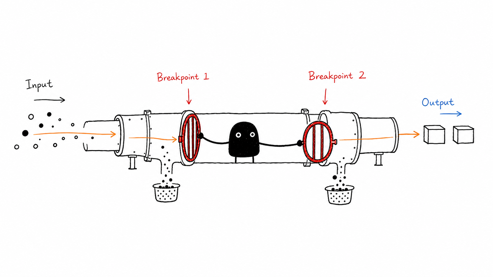
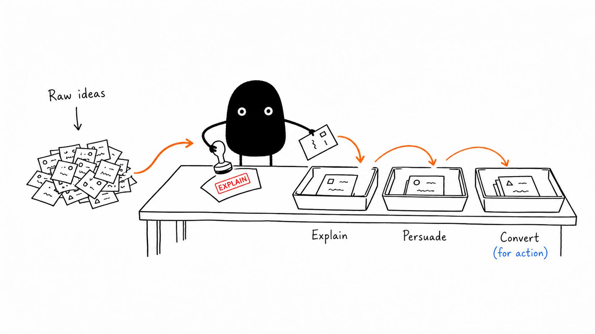
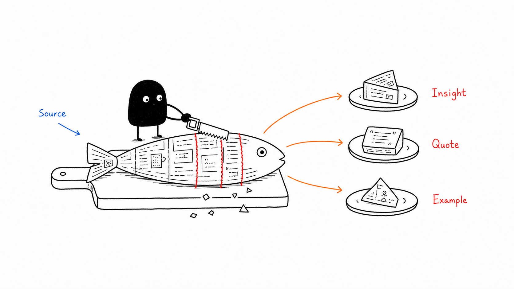
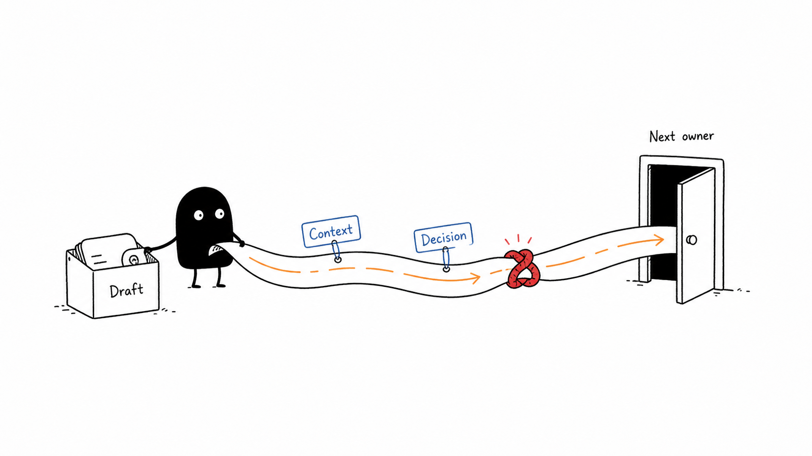
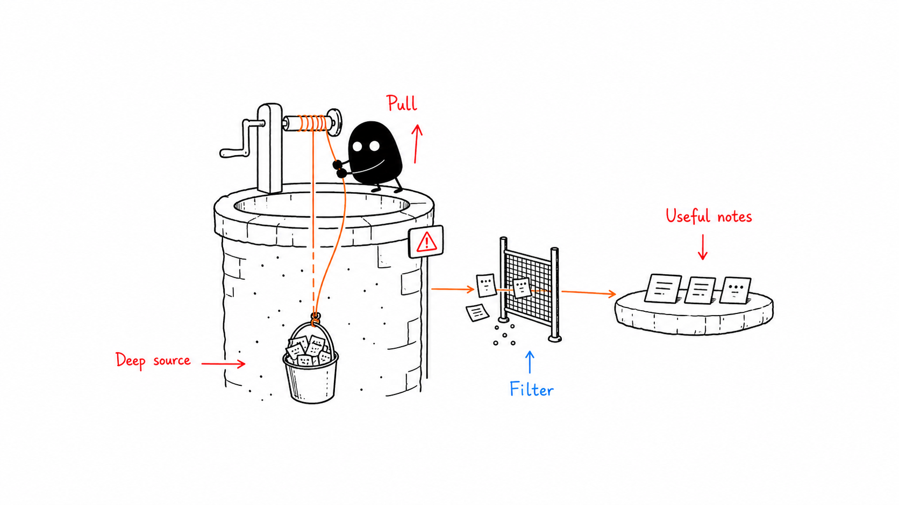
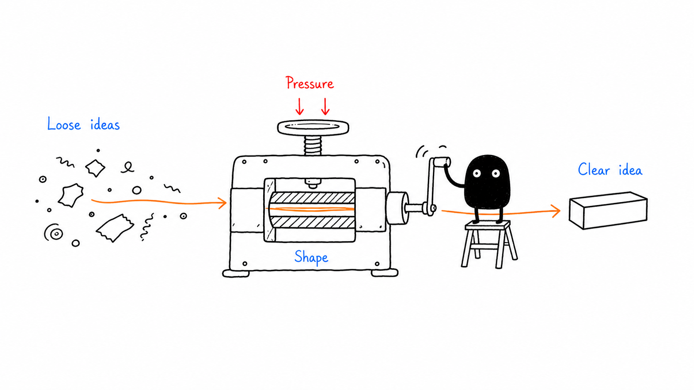
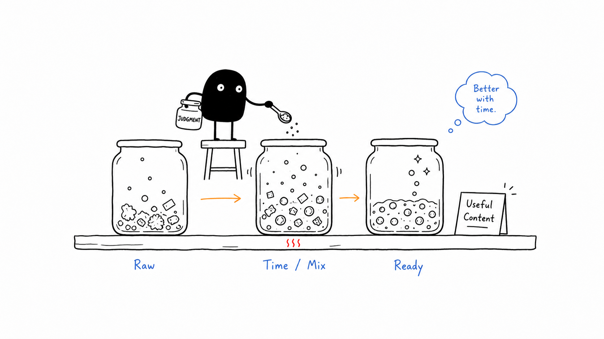
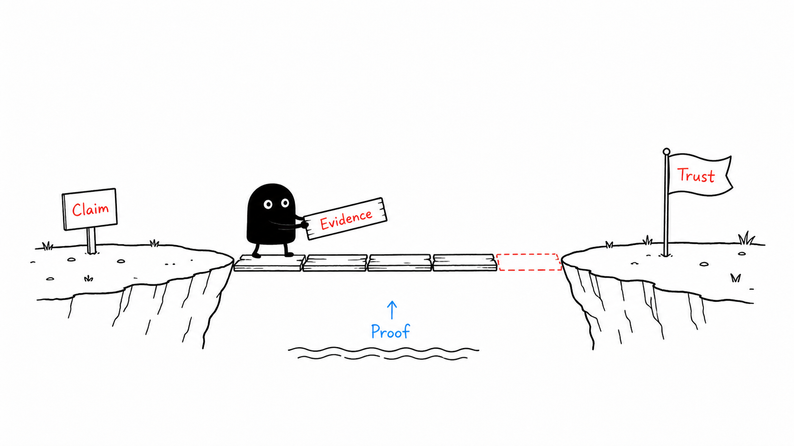

# Visual IP Illustrations

> Visual IP Illustrations is a multi-visual-IP Codex Skill for article body illustrations. Xiaohei is the implicit default route; Littlebox is explicit and active; Tom is an explicit protected-character route with status `gated-authorized`; Ferris is an explicit Rust-community mascot route with status `source-reviewed`; Seal is an explicit product-neutral hoodie seal route with status `active`.
>
> 16:9 horizontal | multi visual IP | article body illustrations | Canonical invocation: `$visual-ip-illustrations`

<!-- README-I18N:START -->

**English** | [Español](./README.es.md) | [Português](./README.pt.md) | [Deutsch](./README.de.md) | [Français](./README.fr.md) | [简体中文](./README.zh.md) | [繁體中文](./README.zh-Hant.md) | [한국어](./README.ko.md) | [日本語](./README.ja.md) | [العربية](./README.ar.md) | [Русский](./README.ru.md) | [Українська](./README.uk.md) | [Türkçe](./README.tr.md)

<!-- README-I18N:END -->

---

## What This Repository Is

Visual IP Illustrations guides an AI agent to create body illustrations for articles, posts, blogs, Notion documents, and methodology writing.

The skill reads the cognitive anchor in the source text, then turns one judgment, workflow, structure, state, or metaphor into a memorable 16:9 hand-drawn explanatory image.

Current route inventory:

- **Xiaohei**: implicit default route. When the user omits a visual IP, the skill uses Xiaohei and preserves the white-background hand-drawn article illustration experience.
- **Littlebox**: explicit active route. Requests that name `小盒`, `Littlebox`, `纸盒`, `paper-box`, or `carton` use the Littlebox route.
- **Tom**: explicit protected-character route. Requests that name `Tom`, `Tom Cat`, `Tom and Jerry`, `汤姆`, or `汤姆猫` use the Tom route.
- **Ferris**: explicit Rust-community mascot route. Requests that name `Ferris`, `Rust mascot`, `Rust crab`, `Rustacean`, `Rust 吉祥物`, or `Rust 螃蟹` use the Ferris route.
- **Seal**: explicit product-neutral hoodie seal route. Requests that name `Seal`, `hoodie seal`, `white seal`, `blue hoodie seal`, `海豹`, `连帽衫海豹`, `白色海豹`, or `蓝色连帽衫海豹` use the Seal route.

Core value: users can choose a visual IP and receive article illustration assets whose character, style rules, prompts, QA gates, saved outputs, attribution, source context, and brand boundary stay consistent with that IP.

Release 1.4 public identity uses `Visual IP Illustrations`, canonical local checkout slug `visual-ip-illustrations`, and canonical invocation `$visual-ip-illustrations`. Compatibility surfaces remain stable: installable package directory `ian-xiaohei-illustrations/`, Legacy compatibility alias `$ian-xiaohei-illustrations`, existing `ian-xiaohei-illustrations/` source paths, route behavior, output directories, and validator markers.

---

## Who It Is For

- Writers who need body illustrations for article concepts.
- Product thinkers and methodology writers who want clear visual metaphors.
- AI workflow authors who need reusable visual-language prompts.
- Codex users who want a stable multi-IP skill package instead of one-off image prompts.

## Outputs

- A 4-8 image shot list for an article.
- For each image: placement, theme, core idea, structure type, character action, and suggested visible labels.
- Final PNG images.
- Xiaohei outputs to workspace path `assets/<article-slug>-illustrations/`.
- Littlebox outputs to workspace path `assets/<article-slug>-littlebox/`.
- Tom outputs to workspace path `assets/<article-slug>-tom/`.
- Ferris outputs to workspace path `assets/<article-slug>-ferris/`.
- Seal outputs to workspace path `assets/<article-slug>-seal/`.

Docs validation also keeps HTML-escaped path markers: `assets/&lt;article-slug&gt;-illustrations/`, `assets/&lt;article-slug&gt;-littlebox/`, `assets/&lt;article-slug&gt;-tom/`, `assets/&lt;article-slug&gt;-ferris/`, and `assets/&lt;article-slug&gt;-seal/`.

---

## Visual IP Routes

### Xiaohei

Xiaohei is the default route: a solid black figure with dot eyes, thin legs, and a blank expression, actively performing a strange but legible cognitive action on a pure white background. It works well for judgments, workflows, breakpoints, traps, handoff paths, and local system views.

Aliases: `小黑`, `Xiaohei`, `Ian`, `ian-xiaohei`.

### Littlebox

Littlebox is an explicit route: a closed paper-box character with rough black marker lines, pale sky-blue or pale lavender background, amber seam tape, and sparse coral accents. It translates a cognitive action into collecting, packing, sorting, handing off, blocking, or repairing.

Aliases: `小盒`, `Littlebox`, `纸盒`, `paper-box`, `carton`.

### Tom

Tom is an explicit protected-character route: the familiar gray-blue cat character carries one article concept through an active comic action while staying inside the route rights boundary. It works well for chase logic, trap setup, failed shortcuts, fragile plans, reversals, timing problems, and cartoon-like cause-effect sequences.

Aliases: `Tom`, `Tom Cat`, `Tom and Jerry`, `汤姆`, `汤姆猫`.

### Ferris

Ferris is an explicit Rust-community mascot route: a compact orange crab mascot performs the central cognitive action through careful building, sorting, guarding, lifting, connecting, or repairing. It works well for systems thinking, reliability, ownership, compilation-like flows, tradeoff review, boundary checks, and low-tech Rust-themed object metaphors.

Aliases: `Ferris`, `Rust mascot`, `Rust crab`, `Rustacean`, `Rust 吉祥物`, `Rust 螃蟹`.

### Seal

Seal is an explicit product-neutral hoodie seal route: a white rounded seal in a plain navy cap and plain deep-blue hoodie performs the article's central judgment, sequence, handoff, comparison, or repair action. It works well for review, prioritization, source-history awareness, logo-free product-neutral scenarios, and low-tech article metaphors.

Aliases: `Seal`, `hoodie seal`, `white seal`, `blue hoodie seal`, `海豹`, `连帽衫海豹`, `白色海豹`, `蓝色连帽衫海豹`.

### Route Reference

Maintainers can inspect route metadata fields in `ian-xiaohei-illustrations/references/routing.md`: `id`, `display_name`, `aliases`, `default`, `output_suffix`, `required_references`, `attribution_context`, and `status`.

Canonical packs:

- Xiaohei: `ian-xiaohei-illustrations/references/ips/xiaohei/`
- Littlebox: `ian-xiaohei-illustrations/references/ips/littlebox/`
- Tom: `ian-xiaohei-illustrations/references/ips/tom/`, core entry `index.md`, rights boundary `ian-xiaohei-illustrations/references/ips/tom/rights.md`
- Ferris: `ian-xiaohei-illustrations/references/ips/ferris/`, source/trademark authority `ian-xiaohei-illustrations/references/ips/ferris/source.md`
- Seal: `ian-xiaohei-illustrations/references/ips/seal/`, source-history authority `ian-xiaohei-illustrations/references/ips/seal/source.md`

When one request asks for multiple visual IPs, deliver by separate variant group and write each group into its own output directory. Xiaohei is the implicit default route; Littlebox is an explicit active route; Tom is an explicit protected-character route with status `gated-authorized`; Ferris is an explicit Rust-community mascot route with status `source-reviewed`; Seal is an explicit product-neutral hoodie seal route with status `active`.

Operational route facts:

- Tom: status `gated-authorized`; rights boundary `ian-xiaohei-illustrations/references/ips/tom/rights.md`; output path `assets/<article-slug>-tom/`; docs validation token `assets/&lt;article-slug&gt;-tom/`; output suffix `tom`; public rendered samples require the `RELEASE_CHECKLIST.md` public-sample gate and Tom rights record approval.
- Ferris: status `source-reviewed`; source/trademark authority `ian-xiaohei-illustrations/references/ips/ferris/source.md`; output path `assets/<article-slug>-ferris/`; docs validation token `assets/&lt;article-slug&gt;-ferris/`; output suffix `ferris`; public rendered samples require the `RELEASE_CHECKLIST.md` Rust trademark and endorsement-safe wording gate. Ferris is an explicit Rust-community mascot route with status source-reviewed; generated public Ferris samples require release review for Rust trademark and endorsement-safe wording.
- Seal: route id `seal`; default=false; status `active`; source-history authority `ian-xiaohei-illustrations/references/ips/seal/source.md`; output path `assets/<article-slug>-seal/`; docs validation token `assets/&lt;article-slug&gt;-seal/`; output suffix `seal`; hoodie seal identity uses a white rounded seal body, plain navy cap, plain deep-blue hoodie, glossy dark eyes, black nose, whisker dots, small smile, short rounded flippers, compact legs, and side-rear white tail; logo-free boundary keeps cap, hoodie chest, mascot body, props, and scene plain and mark-free; product-neutral route isolation keeps Seal separate from product-brand routes; source-history attachment stays required; public rendered samples require release gates for hoodie seal identity, logo-free output, product-neutral route isolation, source-history attachment, and article-metaphor quality.

---

## Example Gallery

These images are Xiaohei style calibration examples. Use them to understand line density, whitespace, color restraint, and character participation, then invent a fresh metaphor for the current article.

### Two Breakpoints



### Sort by Purpose



### One Fish, Many Uses



### Handoff Path



### Information Well



### Idea Press



### Content Fermentation



### Trust Bridge



---

## Installation

```bash
git clone https://github.com/yangchuansheng/ian-xiaohei-illustrations.git visual-ip-illustrations
cd visual-ip-illustrations
mkdir -p "${CODEX_HOME:-$HOME/.codex}/skills"
cp -R ./ian-xiaohei-illustrations "${CODEX_HOME:-$HOME/.codex}/skills/"
```

After installation, prefer `$visual-ip-illustrations` in Codex.

Release 1.4 compatibility:

- Canonical public invocation: `$visual-ip-illustrations`
- Legacy compatibility alias: `$ian-xiaohei-illustrations`
- Installable skill package directory: `ian-xiaohei-illustrations/`
- Current live repository remote: `https://github.com/yangchuansheng/ian-xiaohei-illustrations.git`
- Local checkout target directory: `visual-ip-illustrations`
- Route behavior and output directories remain stable across both invocation surfaces.

---

## Quick Examples

`{visual IP}` can be `Xiaohei`, `Littlebox`, `Tom`, `Ferris`, `Seal`, or a supported alias. Omitted visual IP selects Xiaohei.

### Plan a Shot List

```text
Use $visual-ip-illustrations. Do not generate images yet.
Use {visual IP} to create a 5-image article body illustration shot list for the article below.
For each image, include placement, theme, core idea, structure type, character action, and suggested visible labels in the user's language.

<paste article>
```

### Generate Body Illustrations

```text
Use $visual-ip-illustrations with {visual IP} to generate 4 article body illustrations for the article below.
Each image should express one core idea, and the selected character must carry the action.
Use the selected IP's route-local references, QA checklist, and output path.

<paste article>
```

### Single Idea

```text
Use $visual-ip-illustrations with {visual IP} to generate one 16:9 article body illustration.
Idea: trust is built by placing one piece of evidence after another.
Requirements: hand-drawn, spacious, sparse visible labels in the user's language, and the character performing the central action.
```

### IP Comparison

```text
Use $visual-ip-illustrations. Do not generate images yet.
Create separate Xiaohei, Littlebox, Tom, Ferris, and Seal shot-list groups from the same idea.
Each group must keep its own IP, character action, visible labels, and output path.

Idea: trust is built by placing one piece of evidence after another.
```

Protected-character, source-reviewed, and active source-history routes automatically carry route status, source/rights note, release gate, and route-specific output directory.

More copyable examples are in [examples/prompts.md](examples/prompts.md).

---

## Workflow

1. Read the article, Markdown, Notion content, screenshot, or user-provided topic.
2. Select the visual IP: omitted IP selects Xiaohei; explicit Littlebox selects Littlebox; explicit Tom aliases select the Tom protected-character route; explicit Ferris aliases select the Ferris source-reviewed pack; explicit Seal aliases select the active Seal pack.
3. Extract core claims, cognitive turns, workflow structures, and visualizable paragraphs.
4. Produce a shot list first; each image receives one cognitive anchor.
5. Choose one structure type for each image: Workflow, system local view, before/after, character state, concept metaphor, method layers, map route, or comic panels.
6. Load the selected IP's canonical pack, assemble prompts, and generate images one by one. Mixed-IP requests create separate route groups and separate output directories, with Xiaohei, Littlebox, Tom, Ferris, and Seal each keeping route-local references.
7. Check character identity, composition, background, labels, and output path against the selected IP's QA checklist. Tom keeps `gated-authorized` and `ian-xiaohei-illustrations/references/ips/tom/rights.md`; Ferris keeps `source-reviewed`, source/trademark note, and `ian-xiaohei-illustrations/references/ips/ferris/source.md`; Seal keeps `active`, source-history authority, hoodie seal identity note, logo-free note, and `ian-xiaohei-illustrations/references/ips/seal/source.md`.
8. Save final PNGs and report purpose plus path.

---

## Directory Structure

```text
.
├── README.md
├── README.es.md
├── README.pt.md
├── README.de.md
├── README.fr.md
├── README.zh.md
├── README.zh-Hant.md
├── README.ko.md
├── README.ja.md
├── README.ar.md
├── README.ru.md
├── README.uk.md
├── README.tr.md
├── LICENSE
├── NOTICE.md
├── examples/
│   ├── images/
│   │   ├── 01-two-breakpoints.png
│   │   ├── 02-sort-by-purpose.png
│   │   └── ...
│   ├── images-en/
│   │   ├── 01-two-breakpoints.png
│   │   ├── 02-sort-by-purpose.png
│   │   └── ...
│   └── prompts.md
└── ian-xiaohei-illustrations/
    ├── SKILL.md
    ├── agents/
    │   └── openai.yaml
    ├── assets/
    │   └── examples/
    └── references/
        ├── routing.md
        ├── style-dna.md
        ├── xiaohei-ip.md
        ├── composition-patterns.md
        ├── prompt-template.md
        ├── qa-checklist.md
        └── ips/
            ├── xiaohei/
            │   ├── index.md
            │   ├── style-dna.md
            │   ├── xiaohei-ip.md
            │   ├── composition-patterns.md
            │   ├── prompt-template.md
            │   └── qa-checklist.md
            ├── littlebox/
            │   ├── index.md
            │   ├── style-dna.md
            │   ├── littlebox-ip.md
            │   ├── composition-patterns.md
            │   ├── language-and-labels.md
            │   ├── prompt-template.md
            │   └── qa-checklist.md
            ├── tom/
            │   ├── index.md
            │   ├── rights.md
            │   ├── style-dna.md
            │   ├── tom-ip.md
            │   ├── composition-patterns.md
            │   ├── prompt-template.md
            │   └── qa-checklist.md
            ├── ferris/
            │   ├── index.md
            │   ├── source.md
            │   ├── style-dna.md
            │   ├── ferris-ip.md
            │   ├── composition-patterns.md
            │   ├── prompt-template.md
            │   └── qa-checklist.md
            └── seal/
                ├── index.md
                ├── source.md
                ├── style-dna.md
                ├── seal-ip.md
                ├── composition-patterns.md
                ├── prompt-template.md
                └── qa-checklist.md
```

The Codex install target is this subdirectory:

```text
ian-xiaohei-illustrations/
```

Root README, LICENSE, NOTICE, and examples are GitHub distribution docs.

---

## Maintainer Validation

```bash
node scripts/validate-skill-package.mjs
```

Validation covers skill package shape, route table, Xiaohei, Littlebox, Tom, Ferris, and Seal canonical packs, legacy Xiaohei paths, public docs links, output path markers, NOTICE attribution, Tom `gated-authorized` route markers, Ferris `source-reviewed` route markers, Seal `active` route markers, source-history authority, hoodie seal identity note, logo-free note, and Phase 32 full validator restoration evidence.

Current maintainer validation commands:

```bash
node scripts/validate-skill-package.mjs
node --test scripts/validate-skill-package.test.mjs
git diff --check
```

Pre-release checks live in [RELEASE_CHECKLIST.md](RELEASE_CHECKLIST.md).

---

## License

MIT License. See [LICENSE](LICENSE).
