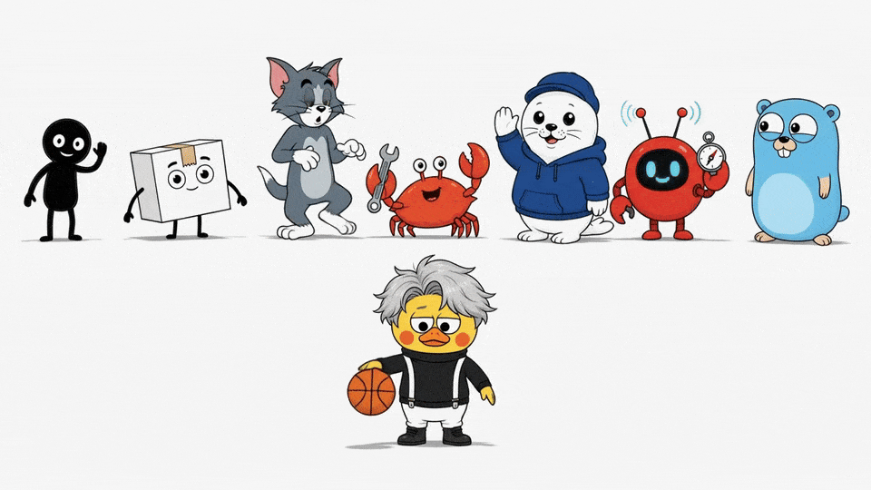

# Visual IP Illustrations



[](https://skills.sh/yangchuansheng/visual-ip-illustrations)

> Visual IP Illustrations is a multi-visual-IP Codex Skill for article body illustrations. Xiaohei is the implicit default route; Littlebox is explicit and active; Tom is an explicit protected-character route with status `gated-authorized`; Ferris is an explicit Rust-community mascot route with status `source-reviewed`; Seal is an explicit product-neutral hoodie seal route with status `active`; OpenClaw is an explicit logo-mascot route with status `source-reviewed`. Go Gopher is an explicit source-reviewed article-illustration mascot route with output path `assets/<article-slug>-gopher/`. Cai Xukun is an explicit `gated-public-figure` stylized mascot-only route with aliases `蔡徐坤`, `caixukun`, and `cxk`, source pointer `skills/visual-ip-illustrations/references/ips/caixukun/source.md`, output path `assets/<article-slug>-caixukun/`, uploaded-image authority, public-figure likeness boundary, source-image context boundary, public sample review gate, route isolation, and safety review for endorsement, affiliation, impersonation, campaign, advertising, and fandom-promotion claims.
>
> 16:9 horizontal | multi visual IP | article body illustrations | Canonical invocation: `$visual-ip-illustrations`

<!-- README-I18N:START -->

**English** | [Español](./readmes/README.es.md) | [Português](./readmes/README.pt.md) | [Deutsch](./readmes/README.de.md) | [Français](./readmes/README.fr.md) | [简体中文](./readmes/README.zh.md) | [繁體中文](./readmes/README.zh-Hant.md) | [한국어](./readmes/README.ko.md) | [日本語](./readmes/README.ja.md) | [العربية](./readmes/README.ar.md) | [Русский](./readmes/README.ru.md) | [Українська](./readmes/README.uk.md) | [Türkçe](./readmes/README.tr.md)

<!-- README-I18N:END -->

---

## What This Repository Is

Visual IP Illustrations guides an AI agent to create body illustrations for articles, posts, blogs, Notion documents, and methodology writing.

The skill reads the cognitive anchor in the source text, then turns one judgment, workflow, structure, state, or metaphor into a memorable 16:9 hand-drawn explanatory image.

Current route inventory:

- **Xiaohei**: implicit default route. When the user omits a visual IP, the skill uses Xiaohei and preserves the white-background hand-drawn article illustration experience.
- **Littlebox**: explicit active route. Requests that name `小盒`, `Littlebox`, `纸盒`, `paper-box`, or `carton` use the Littlebox route.
- **Tom**: explicit protected-character route. Requests that name `Tom`, `Tom Cat`, `Tom and Jerry`, `汤姆`, or `汤姆猫` use the Tom route.
- **Ferris**: explicit Rust-community mascot route. Requests that name `Ferris`, `Rust mascot`, `Rust crab`, `Rustacean`, `Rust 吉祥物`, or `Rust 螃蟹` use the Ferris route.
- **Seal**: explicit product-neutral hoodie seal route. Requests that name `Seal`, `hoodie seal`, `white seal`, `blue hoodie seal`, `海豹`, `连帽衫海豹`, `白色海豹`, or `蓝色连帽衫海豹` use the Seal route.
- **OpenClaw**: explicit logo-mascot route. Requests that name `OpenClaw`, `openclaw`, `OpenClaw logo`, `OpenClaw mascot`, or the OpenClaw aliases listed in `skills/visual-ip-illustrations/references/routing.md` use the OpenClaw route.
- **Go Gopher**: explicit source-reviewed article-illustration mascot route. Requests that name `Go Gopher`, `Gopher`, `golang gopher`, `Go mascot`, or Go Gopher aliases listed in `skills/visual-ip-illustrations/references/routing.md` use the Go Gopher route.
- **Cai Xukun**: explicit `gated-public-figure` stylized mascot-only route. Requests that name `Cai Xukun`, `蔡徐坤`, `caixukun`, or `cxk` use the Cai Xukun route with uploaded-image authority, public-figure likeness boundary, source-image context boundary, public sample review gate, route isolation, source pointer `skills/visual-ip-illustrations/references/ips/caixukun/source.md`, output path `assets/<article-slug>-caixukun/`, and safety review for endorsement, affiliation, impersonation, campaign, advertising, and fandom-promotion claims.

Core value: users can choose a visual IP and receive article illustration assets whose character, style rules, prompts, QA gates, saved outputs, attribution, source context, and brand boundary stay consistent with that IP.

Release 1.4 public identity uses `Visual IP Illustrations`, canonical local checkout slug `visual-ip-illustrations`, and canonical invocation `$visual-ip-illustrations`. Compatibility surfaces remain stable: installable package directory `skills/visual-ip-illustrations/`, Legacy compatibility alias `$ian-xiaohei-illustrations`, existing `skills/visual-ip-illustrations/` source paths, route behavior, output directories, and validator markers.

---

## Who It Is For

- Writers who need body illustrations for article concepts.
- Product thinkers and methodology writers who want clear visual metaphors.
- AI workflow authors who need reusable visual-language prompts.
- Codex users who want a stable multi-IP skill package instead of one-off image prompts.

## Outputs

- A 4-8 image shot list for an article.
- For each image: placement, theme, core idea, structure type, character action, and suggested visible labels.
- Final PNG images.
- Xiaohei outputs to workspace path `assets/<article-slug>-illustrations/`.
- Littlebox outputs to workspace path `assets/<article-slug>-littlebox/`.
- Tom outputs to workspace path `assets/<article-slug>-tom/`.
- Ferris outputs to workspace path `assets/<article-slug>-ferris/`.
- Seal outputs to workspace path `assets/<article-slug>-seal/`.
- OpenClaw outputs to workspace path `assets/<article-slug>-openclaw/`.
- Go Gopher outputs to workspace path `assets/<article-slug>-gopher/`.
- Cai Xukun outputs to workspace path `assets/<article-slug>-caixukun/`.

Docs validation also keeps HTML-escaped path markers: `assets/&lt;article-slug&gt;-illustrations/`, `assets/&lt;article-slug&gt;-littlebox/`, `assets/&lt;article-slug&gt;-tom/`, `assets/&lt;article-slug&gt;-ferris/`, `assets/&lt;article-slug&gt;-seal/`, and `assets/&lt;article-slug&gt;-openclaw/`.
Docs validation also keeps Go Gopher escaped marker: `assets/&lt;article-slug&gt;-gopher/`.
Docs validation also keeps Cai Xukun escaped marker: `assets/&lt;article-slug&gt;-caixukun/`.

---

## Visual IP Routes

### Xiaohei

Xiaohei is the default route: a solid black figure with dot eyes, thin legs, and a blank expression, actively performing a strange but legible cognitive action on a pure white background. It works well for judgments, workflows, breakpoints, traps, handoff paths, and local system views.

Aliases: `小黑`, `Xiaohei`, `Ian`, `ian-xiaohei`.

### Littlebox

Littlebox is an explicit route: a closed paper-box character with rough black marker lines, pale sky-blue or pale lavender background, amber seam tape, and sparse coral accents. It translates a cognitive action into collecting, packing, sorting, handing off, blocking, or repairing.

Aliases: `小盒`, `Littlebox`, `纸盒`, `paper-box`, `carton`.

### Tom

Tom is an explicit protected-character route: the familiar gray-blue cat character carries one article concept through an active comic action while staying inside the route rights boundary. It works well for chase logic, trap setup, failed shortcuts, fragile plans, reversals, timing problems, and cartoon-like cause-effect sequences.

Aliases: `Tom`, `Tom Cat`, `Tom and Jerry`, `汤姆`, `汤姆猫`.

### Ferris

Ferris is an explicit Rust-community mascot route: a compact orange crab mascot performs the central cognitive action through careful building, sorting, guarding, lifting, connecting, or repairing. It works well for systems thinking, reliability, ownership, compilation-like flows, tradeoff review, boundary checks, and low-tech Rust-themed object metaphors.

Aliases: `Ferris`, `Rust mascot`, `Rust crab`, `Rustacean`, `Rust 吉祥物`, `Rust 螃蟹`.

### Seal

Seal is an explicit product-neutral hoodie seal route: a white rounded seal in a plain navy cap and plain deep-blue hoodie performs the article's central judgment, sequence, handoff, comparison, or repair action. It works well for review, prioritization, source-history awareness, logo-free product-neutral scenarios, and low-tech article metaphors.

Aliases: `Seal`, `hoodie seal`, `white seal`, `blue hoodie seal`, `海豹`, `连帽衫海豹`, `白色海豹`, `蓝色连帽衫海豹`.

### OpenClaw

OpenClaw is an explicit logo-mascot route: the official red round OpenClaw logo character performs one article concept through friendly inspecting, holding, bridging, sorting, lifting, or signaling actions. It works well for workflow clarity, compatibility checks, model/tool coordination, review gates, and source-reviewed project metaphors.

Aliases: `OpenClaw`, `openclaw`, `OpenClaw logo`, `OpenClaw mascot`, plus the OpenClaw aliases listed in `skills/visual-ip-illustrations/references/routing.md`.

### Go Gopher

Go Gopher is an explicit source-reviewed article-illustration mascot route: the Go language mascot from route-local `skills/visual-ip-illustrations/references/ips/gopher/gopher.png` carries one article concept through sparse, hand-drawn cognitive actions while preserving the Go blog source context, Renee French attribution, Creative Commons Attribution 4.0 boundary, Go logo boundary, official endorsement boundary, and public sample gate.

Aliases: `Go Gopher`, `Gopher`, `golang gopher`, `Go mascot`, plus Go Gopher aliases listed in `skills/visual-ip-illustrations/references/routing.md`.

### Cai Xukun

Cai Xukun is an explicit `gated-public-figure` stylized mascot-only route. The uploaded reference images are the uploaded-image authority for a sparse article-illustration mascot, with public-figure likeness boundary, source-image context boundary, public sample review gate, route isolation, and stylized mascot-only output. Public docs use source pointer `skills/visual-ip-illustrations/references/ips/caixukun/source.md` and output path `assets/<article-slug>-caixukun/`.

Aliases: `Cai Xukun`, `蔡徐坤`, `caixukun`, `cxk`.

Safety boundary: generated text and release copy must keep endorsement, affiliation, impersonation, campaign, advertising, and fandom-promotion claims inside maintainer review and rewrite them as neutral article-concept labels.

### Route Reference

Maintainers can inspect route metadata fields in `skills/visual-ip-illustrations/references/routing.md`: `id`, `display_name`, `aliases`, `default`, `output_suffix`, `required_references`, `attribution_context`, and `status`.

Canonical packs:

- Xiaohei: `skills/visual-ip-illustrations/references/ips/xiaohei/`
- Littlebox: `skills/visual-ip-illustrations/references/ips/littlebox/`
- Tom: `skills/visual-ip-illustrations/references/ips/tom/`, core entry `index.md`, rights boundary `skills/visual-ip-illustrations/references/ips/tom/rights.md`
- Ferris: `skills/visual-ip-illustrations/references/ips/ferris/`, source/trademark authority `skills/visual-ip-illustrations/references/ips/ferris/source.md`
- Seal: `skills/visual-ip-illustrations/references/ips/seal/`, source-history authority `skills/visual-ip-illustrations/references/ips/seal/source.md`
- OpenClaw: `skills/visual-ip-illustrations/references/ips/openclaw/`, source/license authority `skills/visual-ip-illustrations/references/ips/openclaw/source.md`
- Go Gopher: `skills/visual-ip-illustrations/references/ips/gopher/`, source/license authority `skills/visual-ip-illustrations/references/ips/gopher/source.md`
- Cai Xukun: `skills/visual-ip-illustrations/references/ips/caixukun/`, source authority `skills/visual-ip-illustrations/references/ips/caixukun/source.md`

When one request asks for multiple visual IPs, deliver by separate variant group and write each group into its own output directory. Xiaohei is the implicit default route; Littlebox is an explicit active route; Tom is an explicit protected-character route with status `gated-authorized`; Ferris is an explicit Rust-community mascot route with status `source-reviewed`; Seal is an explicit product-neutral hoodie seal route with status `active`; OpenClaw is an explicit logo-mascot route with status `source-reviewed`.

Cai Xukun route usage keeps `gated-public-figure`, uploaded-image authority, public-figure likeness boundary, source-image context boundary, public sample review gate, route isolation, stylized mascot-only output, `skills/visual-ip-illustrations/references/ips/caixukun/source.md`, `assets/<article-slug>-caixukun/`, and `assets/&lt;article-slug&gt;-caixukun/` attached to planning, generation, edit, QA, delivery, and release review.

Operational route facts:

- Tom: status `gated-authorized`; rights boundary `skills/visual-ip-illustrations/references/ips/tom/rights.md`; output path `assets/<article-slug>-tom/`; docs validation token `assets/&lt;article-slug&gt;-tom/`; output suffix `tom`; public rendered samples require the `RELEASE_CHECKLIST.md` public-sample gate and Tom rights record approval.
- Ferris: status `source-reviewed`; source/trademark authority `skills/visual-ip-illustrations/references/ips/ferris/source.md`; output path `assets/<article-slug>-ferris/`; docs validation token `assets/&lt;article-slug&gt;-ferris/`; output suffix `ferris`; public rendered samples require the `RELEASE_CHECKLIST.md` Rust trademark and endorsement-safe wording gate. Ferris is an explicit Rust-community mascot route with status source-reviewed; generated public Ferris samples require release review for Rust trademark and endorsement-safe wording.
- Seal: route id `seal`; default=false; status `active`; source-history authority `skills/visual-ip-illustrations/references/ips/seal/source.md`; output path `assets/<article-slug>-seal/`; docs validation token `assets/&lt;article-slug&gt;-seal/`; output suffix `seal`; hoodie seal identity uses a white rounded seal body, plain navy cap, plain deep-blue hoodie, glossy dark eyes, black nose, whisker dots, small smile, short rounded flippers, compact legs, and side-rear white tail; logo-free boundary keeps cap, hoodie chest, mascot body, props, and scene plain and mark-free; product-neutral route isolation keeps Seal separate from product-brand routes; source-history attachment stays required; public rendered samples require release gates for hoodie seal identity, logo-free output, product-neutral route isolation, source-history attachment, and article-metaphor quality.
- OpenClaw: route id `openclaw`; default=false; status `source-reviewed`; source/license authority `skills/visual-ip-illustrations/references/ips/openclaw/source.md`; output path `assets/<article-slug>-openclaw/`; docs validation token `assets/&lt;article-slug&gt;-openclaw/`; output suffix `openclaw`; uploaded-logo identity uses a red round body, side claw-like arms, two antennae, black eyes, cyan pupils, and short legs; public rendered samples require the `RELEASE_CHECKLIST.md` public-sample gate and final OpenClaw release evidence.
- Go Gopher: route id `gopher`; default=false; status `source-reviewed`; source/license authority `skills/visual-ip-illustrations/references/ips/gopher/source.md`; output path `assets/<article-slug>-gopher/`; docs validation token `assets/&lt;article-slug&gt;-gopher/`; output suffix `gopher`; local visual authority route-local `skills/visual-ip-illustrations/references/ips/gopher/gopher.png`; attribution Renee French; license boundary Creative Commons Attribution 4.0; public rendered samples require the `RELEASE_CHECKLIST.md` public-sample gate and Phase 42 Go Gopher release evidence; Go logo boundary and official endorsement boundary stay attached.
- Cai Xukun: route id `caixukun`; default=false; status `gated-public-figure`; source authority `skills/visual-ip-illustrations/references/ips/caixukun/source.md`; output path `assets/<article-slug>-caixukun/`; docs validation token `assets/&lt;article-slug&gt;-caixukun/`; output suffix `caixukun`; aliases `Cai Xukun`, `蔡徐坤`, `caixukun`, and `cxk`; uploaded-image authority and source-image context boundary stay attached; public-figure likeness boundary keeps the route in stylized mascot-only output; route isolation keeps Cai Xukun separate from Xiaohei, Littlebox, Tom, Ferris, Seal, OpenClaw, and Go Gopher; public generated sample assets are approved for the Trust Bridge public README gallery through the public sample review gate; endorsement, affiliation, impersonation, campaign, advertising, and fandom-promotion claims require maintainer review and neutral article-concept wording.

---

## Example Gallery

These images are approved public English calibration examples for the current visual IP routes with approved public sample assets: Xiaohei, Littlebox, Tom, Ferris, Seal, OpenClaw, Go Gopher, and Cai Xukun. Cai Xukun currently appears in the Trust Bridge row through the public sample review gate. Each row keeps the same concept and shows how each approved public-sample IP translates the action through its route-local style, character rules, source boundaries, and QA gates.

### Two Breakpoints

| Xiaohei | Littlebox | Tom | Ferris | Seal | OpenClaw | Go Gopher |
|---------|-----------|-----|--------|------|----------|-----------|
|  |  |  |  |  |  |  |

### Sort by Purpose

| Xiaohei | Littlebox | Tom | Ferris | Seal | OpenClaw | Go Gopher |
|---------|-----------|-----|--------|------|----------|-----------|
|  |  |  |  |  |  |  |

### One Fish, Many Uses

| Xiaohei | Littlebox | Tom | Ferris | Seal | OpenClaw | Go Gopher |
|---------|-----------|-----|--------|------|----------|-----------|
|  |  |  |  |  |  |  |

### Handoff Path

| Xiaohei | Littlebox | Tom | Ferris | Seal | OpenClaw | Go Gopher |
|---------|-----------|-----|--------|------|----------|-----------|
|  |  |  |  |  |  |  |

### Information Well

| Xiaohei | Littlebox | Tom | Ferris | Seal | OpenClaw | Go Gopher |
|---------|-----------|-----|--------|------|----------|-----------|
|  |  |  |  |  |  |  |

### Idea Press

| Xiaohei | Littlebox | Tom | Ferris | Seal | OpenClaw | Go Gopher |
|---------|-----------|-----|--------|------|----------|-----------|
|  |  |  |  |  |  |  |

### Content Fermentation

| Xiaohei | Littlebox | Tom | Ferris | Seal | OpenClaw | Go Gopher |
|---------|-----------|-----|--------|------|----------|-----------|
|  |  |  |  |  |  |  |

### Trust Bridge

| Xiaohei | Littlebox | Tom | Ferris | Seal | OpenClaw | Go Gopher | Cai Xukun |
|---------|-----------|-----|--------|------|----------|-----------|-----------|
|  |  |  |  |  |  |  |  |

---

## Installation

Install with the skills CLI:

```bash
npx skills add yangchuansheng/visual-ip-illustrations --skill visual-ip-illustrations
```

Manual Codex install:

```bash
git clone https://github.com/yangchuansheng/visual-ip-illustrations.git visual-ip-illustrations
cd visual-ip-illustrations
mkdir -p "${CODEX_HOME:-$HOME/.codex}/skills"
cp -R ./skills/visual-ip-illustrations "${CODEX_HOME:-$HOME/.codex}/skills/"
```

After installation, prefer `$visual-ip-illustrations` in Codex.

Release 1.4 compatibility:

- Canonical public invocation: `$visual-ip-illustrations`
- Legacy compatibility alias: `$ian-xiaohei-illustrations`
- Installable skill package directory: `skills/visual-ip-illustrations/`
- Current live repository remote: `https://github.com/yangchuansheng/visual-ip-illustrations.git`
- Local checkout target directory: `visual-ip-illustrations`
- Route behavior and output directories remain stable across both invocation surfaces.

---

## Quick Examples

`{visual IP}` can be `Xiaohei`, `Littlebox`, `Tom`, `Ferris`, `Seal`, `OpenClaw`, `Go Gopher`, `Cai Xukun`, or a supported alias. Omitted visual IP selects Xiaohei.

### Plan a Shot List

```text
Use $visual-ip-illustrations. Do not generate images yet.
Use {visual IP} to create a 5-image article body illustration shot list for the article below.
For each image, include placement, theme, core idea, structure type, character action, and suggested visible labels in the user's language.

<paste article>
```

### Generate Body Illustrations

```text
Use $visual-ip-illustrations with {visual IP} to generate 4 article body illustrations for the article below.
Each image should express one core idea, and the selected character must carry the action.
Use the selected IP's route-local references, QA checklist, and output path.

<paste article>
```

### Single Idea

```text
Use $visual-ip-illustrations with {visual IP} to generate one 16:9 article body illustration.
Idea: trust is built by placing one piece of evidence after another.
Requirements: hand-drawn, spacious, sparse visible labels in the user's language, and the character performing the central action.
```

### IP Comparison

```text
Use $visual-ip-illustrations. Do not generate images yet.
Create separate Xiaohei, Littlebox, Tom, Ferris, Seal, OpenClaw, Go Gopher, and Cai Xukun shot-list groups from the same idea.
Each group must keep its own IP, character action, visible labels, and output path.

Idea: trust is built by placing one piece of evidence after another.
```

Protected-character, source-reviewed, active source-history, and gated-public-figure routes automatically carry route status, source/rights note, release gate, and route-specific output directory. Cai Xukun additionally carries uploaded-image authority, public-figure likeness boundary, source-image context boundary, public sample review gate, route isolation, stylized mascot-only output, and endorsement, affiliation, impersonation, campaign, advertising, and fandom-promotion review terms.

More copyable examples are in [examples/prompts.md](examples/prompts.md).

---

## Workflow

1. Read the article, Markdown, Notion content, screenshot, or user-provided topic.
2. Select the visual IP: omitted IP selects Xiaohei; explicit Littlebox selects Littlebox; explicit Tom aliases select the Tom protected-character route; explicit Ferris aliases select the Ferris source-reviewed pack; explicit Seal aliases select the active Seal pack; explicit OpenClaw aliases select the OpenClaw source-reviewed pack. Explicit Go Gopher aliases select the Go Gopher source-reviewed pack. Explicit Cai Xukun aliases select the Cai Xukun gated-public-figure pack.
3. Extract core claims, cognitive turns, workflow structures, and visualizable paragraphs.
4. Produce a shot list first; each image receives one cognitive anchor.
5. Choose one structure type for each image: Workflow, system local view, before/after, character state, concept metaphor, method layers, map route, or comic panels.
6. Load the selected IP's canonical pack, assemble prompts, and generate images one by one. Mixed-IP requests create separate route groups and separate output directories, with Xiaohei, Littlebox, Tom, Ferris, Seal, OpenClaw, Go Gopher, and Cai Xukun each keeping route-local references.
7. Check character identity, composition, background, labels, and output path against the selected IP's QA checklist. Tom keeps `gated-authorized` and `skills/visual-ip-illustrations/references/ips/tom/rights.md`; Ferris keeps `source-reviewed`, source/trademark note, and `skills/visual-ip-illustrations/references/ips/ferris/source.md`; Seal keeps `active`, source-history authority, hoodie seal identity note, logo-free note, and `skills/visual-ip-illustrations/references/ips/seal/source.md`; OpenClaw keeps `source-reviewed`, source/license authority, uploaded-logo identity, public-sample gate, and `skills/visual-ip-illustrations/references/ips/openclaw/source.md`. Go Gopher keeps `source-reviewed`, source/license authority, route-local `skills/visual-ip-illustrations/references/ips/gopher/gopher.png`, public-sample gate, and `references/ips/gopher/source.md` in the delivery notes. Cai Xukun keeps `gated-public-figure`, uploaded-image authority, public-figure likeness boundary, source-image context boundary, public sample review gate, route isolation, stylized mascot-only output, `skills/visual-ip-illustrations/references/ips/caixukun/source.md`, and `assets/<article-slug>-caixukun/` in the delivery notes.
8. Save final PNGs and report purpose plus path.

---

## Directory Structure

```text
.
├── README.md
├── readmes/
│   ├── README.es.md
│   ├── README.pt.md
│   ├── README.de.md
│   ├── README.fr.md
│   ├── README.zh.md
│   ├── README.zh-Hant.md
│   ├── README.ko.md
│   ├── README.ja.md
│   ├── README.ar.md
│   ├── README.ru.md
│   ├── README.uk.md
│   └── README.tr.md
├── LICENSE
├── NOTICE.md
├── examples/
│   ├── images/
│   │   ├── 01-two-breakpoints.png
│   │   ├── 02-sort-by-purpose.png
│   │   └── ...
│   ├── images-en/
│   │   ├── 01-two-breakpoints.png
│   │   ├── 02-sort-by-purpose.png
│   │   └── ...
│   └── prompts.md
└── skills/
    └── visual-ip-illustrations/
        ├── SKILL.md
        ├── agents/
        │   └── openai.yaml
        ├── assets/
        │   └── examples/
        └── references/
            ├── routing.md
            ├── style-dna.md
            ├── xiaohei-ip.md
            ├── composition-patterns.md
            ├── prompt-template.md
            ├── qa-checklist.md
            └── ips/
                ├── xiaohei/
                │   ├── index.md
                │   ├── style-dna.md
                │   ├── xiaohei-ip.md
                │   ├── composition-patterns.md
                │   ├── prompt-template.md
                │   └── qa-checklist.md
                ├── littlebox/
                │   ├── index.md
                │   ├── style-dna.md
                │   ├── littlebox-ip.md
                │   ├── composition-patterns.md
                │   ├── language-and-labels.md
                │   ├── prompt-template.md
                │   └── qa-checklist.md
                ├── tom/
                │   ├── index.md
                │   ├── rights.md
                │   ├── style-dna.md
                │   ├── tom-ip.md
                │   ├── composition-patterns.md
                │   ├── prompt-template.md
                │   └── qa-checklist.md
                ├── ferris/
                │   ├── index.md
                │   ├── source.md
                │   ├── style-dna.md
                │   ├── ferris-ip.md
                │   ├── composition-patterns.md
                │   ├── prompt-template.md
                │   └── qa-checklist.md
                ├── seal/
                │   ├── index.md
                │   ├── source.md
                │   ├── style-dna.md
                │   ├── seal-ip.md
                │   ├── composition-patterns.md
                │   ├── prompt-template.md
                │   └── qa-checklist.md
                ├── openclaw/
                │   ├── index.md
                │   ├── source.md
                │   ├── style-dna.md
                │   ├── openclaw-ip.md
                │   ├── composition-patterns.md
                │   ├── prompt-template.md
                │   └── qa-checklist.md
                ├── gopher/
                │   ├── index.md
                │   ├── source.md
                │   ├── style-dna.md
                │   ├── gopher-ip.md
                │   ├── composition-patterns.md
                │   ├── prompt-template.md
                │   └── qa-checklist.md
                └── caixukun/
                    ├── index.md
                    ├── source.md
                    ├── style-dna.md
                    ├── caixukun-ip.md
                    ├── composition-patterns.md
                    ├── prompt-template.md
                    └── qa-checklist.md
```

The Codex install target is this subdirectory:

```text
skills/visual-ip-illustrations/
```

Root README, LICENSE, NOTICE, and examples are GitHub distribution docs.

---

## Maintainer Validation

```bash
node scripts/validate-skill-package.mjs
```

Validation covers skill package shape, route table, Xiaohei, Littlebox, Tom, Ferris, Seal, OpenClaw, and Go Gopher canonical packs, legacy Xiaohei paths, public docs links, output path markers, NOTICE attribution, Tom `gated-authorized` route markers, Ferris `source-reviewed` route markers, Seal `active` route markers, OpenClaw `source-reviewed` route markers, source-history authority, source/license authority, hoodie seal identity note, logo-free note, uploaded-logo identity note, and Phase 37 final release evidence.
Validation also covers Go Gopher canonical pack markers, Go Gopher `source-reviewed` route markers, source/license authority, route-local `skills/visual-ip-illustrations/references/ips/gopher/gopher.png`, public sample gate, Phase 42 final release evidence, and Go Gopher validator checks. Phase 46 public docs cover Cai Xukun canonical pack markers, Cai Xukun `gated-public-figure` route markers, source authority `skills/visual-ip-illustrations/references/ips/caixukun/source.md`, uploaded-image authority, public-figure likeness boundary, source-image context boundary, public sample review gate, route isolation, stylized mascot-only output, `assets/<article-slug>-caixukun/`, `assets/&lt;article-slug&gt;-caixukun/`, and endorsement, affiliation, impersonation, campaign, advertising, and fandom-promotion review terms; Phase 47 owns validator hardening and final release evidence.

Current maintainer validation commands:

```bash
node scripts/validate-skill-package.mjs
node --test scripts/validate-skill-package.test.mjs
git diff --check
```

Pre-release checks live in [RELEASE_CHECKLIST.md](RELEASE_CHECKLIST.md).

---

---

## License

MIT License. See [LICENSE](LICENSE).
