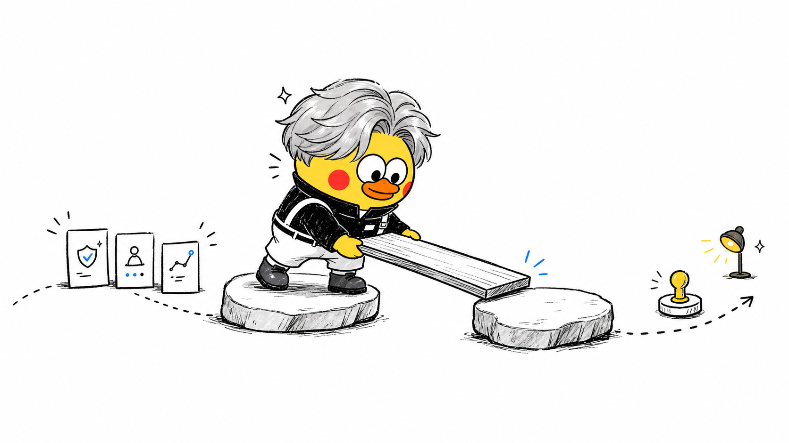

# Visual IP Illustrations


[](https://skills.sh/yangchuansheng/visual-ip-illustrations)

> Visual IP Illustrations es una Codex Skill de múltiples IP visuales para ilustraciones dentro del cuerpo de artículos. Xiaohei es la ruta predeterminada implícita; Littlebox es explícita y activa; Tom es una ruta explícita de personaje protegido con estado `gated-authorized`; Ferris es una ruta explícita de mascota de la comunidad Rust con estado `source-reviewed`; Seal es una ruta explícita de foca con sudadera, neutral al producto, con estado `active`; OpenClaw es una ruta explícita de logo-mascota con estado `source-reviewed`. Go Gopher is an explicit source-reviewed article-illustration mascot route with output path `assets/<article-slug>-gopher/`. Cai Xukun is an explicit `gated-public-figure` stylized mascot-only route with aliases `蔡徐坤`, `caixukun`, and `cxk`, source pointer `skills/visual-ip-illustrations/references/ips/caixukun/source.md`, output path `assets/<article-slug>-caixukun/`, uploaded-image authority, public-figure likeness boundary, source-image context boundary, public sample review gate, route isolation, and safety review for endorsement, affiliation, impersonation, campaign, advertising, and fandom-promotion claims.
>
> 16:9 horizontal | múltiples IP visuales | ilustraciones para cuerpo de artículos | Invocación canónica: `$visual-ip-illustrations`

<!-- README-I18N:START -->

[English](../README.md) | **Español** | [Português](./README.pt.md) | [Deutsch](./README.de.md) | [Français](./README.fr.md) | [简体中文](./README.zh.md) | [繁體中文](./README.zh-Hant.md) | [한국어](./README.ko.md) | [日本語](./README.ja.md) | [العربية](./README.ar.md) | [Русский](./README.ru.md) | [Українська](./README.uk.md) | [Türkçe](./README.tr.md)

<!-- README-I18N:END -->

---

## Qué es este repositorio

Visual IP Illustrations guía a un agente de IA para crear ilustraciones de cuerpo para artículos, posts, blogs, documentos de Notion y escritura metodológica.

La skill lee el ancla cognitiva del texto fuente y convierte un juicio, workflow, estructura, estado o metáfora en una imagen explicativa memorable, dibujada a mano en 16:9.

Inventario actual de rutas:

- **Xiaohei**: ruta predeterminada implícita. Cuando el usuario omite una IP visual, la skill usa Xiaohei y conserva la experiencia de ilustración dibujada a mano sobre fondo blanco.
- **Littlebox**: ruta explícita activa. Las solicitudes que nombran `小盒`, `Littlebox`, `纸盒`, `paper-box` o `carton` usan la ruta Littlebox.
- **Tom**: ruta explícita de personaje protegido. Las solicitudes que nombran `Tom`, `Tom Cat`, `Tom and Jerry`, `汤姆` o `汤姆猫` usan la ruta Tom.
- **Ferris**: ruta explícita de mascota de la comunidad Rust. Las solicitudes que nombran `Ferris`, `Rust mascot`, `Rust crab`, `Rustacean`, `Rust 吉祥物` o `Rust 螃蟹` usan la ruta Ferris.
- **Seal**: ruta explícita de foca con sudadera neutral al producto. Las solicitudes que nombran `Seal`, `hoodie seal`, `white seal`, `blue hoodie seal`, `海豹`, `连帽衫海豹`, `白色海豹` o `蓝色连帽衫海豹` usan la ruta Seal.
- **OpenClaw**: ruta explícita de logo-mascota con estado `source-reviewed`. Las solicitudes que nombran `OpenClaw`, `openclaw`, `OpenClaw logo`, `OpenClaw mascot` o los alias OpenClaw listados en `skills/visual-ip-illustrations/references/routing.md` usan la ruta OpenClaw.
- **Go Gopher**: explicit source-reviewed article-illustration mascot route. Requests that name `Go Gopher`, `Gopher`, `golang gopher`, `Go mascot`, `Go 吉祥物`, `Gopher 吉祥物`, or Go Gopher aliases listed in `skills/visual-ip-illustrations/references/routing.md` use the Go Gopher route.
- **Cai Xukun**: explicit `gated-public-figure` stylized mascot-only route. Requests that name `Cai Xukun`, `蔡徐坤`, `caixukun`, or `cxk` use the Cai Xukun route with uploaded-image authority, public-figure likeness boundary, source-image context boundary, public sample review gate, route isolation, source pointer `skills/visual-ip-illustrations/references/ips/caixukun/source.md`, output path `assets/<article-slug>-caixukun/`, and safety review for endorsement, affiliation, impersonation, campaign, advertising, and fandom-promotion claims.

Valor central: los usuarios pueden elegir una IP visual y recibir recursos de ilustración de artículos cuyos personajes, reglas de estilo, prompts, puertas de QA, salidas guardadas, atribución, contexto de origen y límites de marca se mantienen coherentes con esa IP.

La identidad pública de Release 1.4 usa `Visual IP Illustrations`, el slug canónico de checkout local `visual-ip-illustrations` y la invocación canónica `$visual-ip-illustrations`. Las superficies de compatibilidad siguen estables: directorio instalable `skills/visual-ip-illustrations/`, alias de compatibilidad legacy `$ian-xiaohei-illustrations`, rutas fuente existentes `skills/visual-ip-illustrations/`, comportamiento de rutas, directorios de salida y marcadores del validador.

---

## Para quién es

- Escritores que necesitan ilustraciones de cuerpo para conceptos de artículos.
- Pensadores de producto y autores de metodología que quieren metáforas visuales claras.
- Autores de flujos de trabajo de IA que necesitan prompts reutilizables de lenguaje visual.
- Usuarios de Codex que quieren un paquete skill multi-IP estable.

## Salidas

- Una shot list de 4-8 imágenes para un artículo.
- Para cada imagen: ubicación, tema, idea central, tipo de estructura, acción del personaje y etiquetas visibles sugeridas.
- Imágenes PNG finales.
- Xiaohei guarda salidas en `assets/<article-slug>-illustrations/` dentro del workspace.
- Littlebox guarda salidas en `assets/<article-slug>-littlebox/` dentro del workspace.
- Tom guarda salidas en `assets/<article-slug>-tom/` dentro del workspace.
- Ferris guarda salidas en `assets/<article-slug>-ferris/` dentro del workspace.
- Seal guarda salidas en `assets/<article-slug>-seal/` dentro del workspace.
- OpenClaw escribe salidas en el workspace path `assets/<article-slug>-openclaw/`.
- Go Gopher outputs to workspace path `assets/<article-slug>-gopher/`.
- Cai Xukun outputs to workspace path `assets/<article-slug>-caixukun/`.

La validación de docs también conserva marcadores de ruta escapados en HTML: `assets/&lt;article-slug&gt;-illustrations/`, `assets/&lt;article-slug&gt;-littlebox/`, `assets/&lt;article-slug&gt;-tom/`, `assets/&lt;article-slug&gt;-ferris/`, `assets/&lt;article-slug&gt;-seal/` y `assets/&lt;article-slug&gt;-openclaw/`.
Docs validation also keeps Go Gopher escaped marker: `assets/&lt;article-slug&gt;-gopher/`.
Docs validation also keeps Cai Xukun escaped marker: `assets/&lt;article-slug&gt;-caixukun/`.

---

## Rutas de IP visual

### Xiaohei

Xiaohei es la ruta predeterminada: una figura negra sólida con ojos de punto, piernas delgadas y expresión neutra, que realiza activamente una acción cognitiva extraña pero legible sobre fondo blanco puro. Funciona bien para juicios, workflows, puntos de ruptura, trampas, rutas de traspaso y vistas locales de sistemas.

Alias: `小黑`, `Xiaohei`, `Ian`, `ian-xiaohei`.

### Littlebox

Littlebox es una ruta explícita: un personaje de caja de papel cerrada con líneas negras rugosas de marcador, fondo azul cielo pálido o lavanda pálido, cinta ámbar y acentos coral escasos. Traduce una acción cognitiva en recolectar, empacar, ordenar, entregar, bloquear o reparar.

Alias: `小盒`, `Littlebox`, `纸盒`, `paper-box`, `carton`.

### Tom

Tom es una ruta explícita de personaje protegido: el conocido gato azul grisáceo lleva un concepto de artículo mediante una acción cómica activa dentro del límite de derechos de la ruta. Funciona bien para lógica de persecución, trampas, atajos fallidos, planes frágiles, reversiones, problemas de timing y secuencias de causa-efecto estilo caricatura.

Alias: `Tom`, `Tom Cat`, `Tom and Jerry`, `汤姆`, `汤姆猫`.

### Ferris

Ferris es una ruta explícita de mascota de la comunidad Rust: una mascota compacta de cangrejo naranja realiza la acción cognitiva central construyendo, ordenando, protegiendo, levantando, conectando o reparando con cuidado. Funciona bien para pensamiento sistémico, fiabilidad, ownership, flujos tipo compilación, revisión de tradeoffs, comprobaciones de límites y metáforas de objetos Rust de baja tecnología.

Alias: `Ferris`, `Rust mascot`, `Rust crab`, `Rustacean`, `Rust 吉祥物`, `Rust 螃蟹`.

### Seal

Seal es una ruta explícita de foca con sudadera neutral al producto: una foca blanca y redondeada con gorra azul marino lisa y sudadera azul profunda lisa realiza el juicio, secuencia, traspaso, comparación o reparación central del artículo. Funciona bien para revisión, priorización, conciencia de historial de origen, escenarios sin logos y metáforas de artículo de baja tecnología.

Alias: `Seal`, `hoodie seal`, `white seal`, `blue hoodie seal`, `海豹`, `连帽衫海豹`, `白色海豹`, `蓝色连帽衫海豹`.

### OpenClaw

OpenClaw es una ruta explícita de logo-mascota: el personaje oficial rojo y redondo del logo OpenClaw representa un concepto de artículo mediante acciones amistosas de inspeccionar, sostener, tender puentes, ordenar, levantar o señalar. Funciona bien para claridad de workflow, comprobaciones de compatibilidad, coordinación modelo/herramienta, puertas de revisión y metáforas de proyecto source-reviewed.

Alias: `OpenClaw`, `openclaw`, `OpenClaw logo`, `OpenClaw mascot`, además de los alias OpenClaw listados en `skills/visual-ip-illustrations/references/routing.md`.

### Go Gopher

Go Gopher is an explicit source-reviewed article-illustration mascot route: the Go language mascot from route-local `skills/visual-ip-illustrations/references/ips/gopher/gopher.png` carries one article concept through sparse, hand-drawn cognitive actions while preserving the Go blog source context, Renee French attribution, Creative Commons Attribution 4.0 boundary, Go logo boundary, official endorsement boundary, and public sample gate.

Aliases: `Go Gopher`, `Gopher`, `golang gopher`, `Go mascot`, plus Go Gopher aliases listed in `skills/visual-ip-illustrations/references/routing.md`.

### Cai Xukun

Cai Xukun is an explicit `gated-public-figure` stylized mascot-only route. The uploaded reference images are the uploaded-image authority for a sparse article-illustration mascot, with public-figure likeness boundary, source-image context boundary, public sample review gate, route isolation, and stylized mascot-only output. Public docs use source pointer `skills/visual-ip-illustrations/references/ips/caixukun/source.md` and output path `assets/<article-slug>-caixukun/`.

Aliases: `Cai Xukun`, `蔡徐坤`, `caixukun`, `cxk`.

Safety boundary: generated text and release copy must keep endorsement, affiliation, impersonation, campaign, advertising, and fandom-promotion claims inside maintainer review and rewrite them as neutral article-concept labels.

### Referencia de rutas

Los mantenedores pueden revisar los campos de metadata de rutas en `skills/visual-ip-illustrations/references/routing.md`: `id`, `display_name`, `aliases`, `default`, `output_suffix`, `required_references`, `attribution_context` y `status`.

Packs canónicos:

- Xiaohei: `skills/visual-ip-illustrations/references/ips/xiaohei/`
- Littlebox: `skills/visual-ip-illustrations/references/ips/littlebox/`
- Tom: `skills/visual-ip-illustrations/references/ips/tom/`, core entry `index.md`, rights boundary `skills/visual-ip-illustrations/references/ips/tom/rights.md`
- Ferris: `skills/visual-ip-illustrations/references/ips/ferris/`, source/trademark authority `skills/visual-ip-illustrations/references/ips/ferris/source.md`
- Seal: `skills/visual-ip-illustrations/references/ips/seal/`, source-history authority `skills/visual-ip-illustrations/references/ips/seal/source.md`
- OpenClaw: `skills/visual-ip-illustrations/references/ips/openclaw/`, source/license authority `skills/visual-ip-illustrations/references/ips/openclaw/source.md`
- Go Gopher: `skills/visual-ip-illustrations/references/ips/gopher/`, source/license authority `skills/visual-ip-illustrations/references/ips/gopher/source.md`
- Cai Xukun: `skills/visual-ip-illustrations/references/ips/caixukun/`, source authority `skills/visual-ip-illustrations/references/ips/caixukun/source.md`

Cuando una solicitud pide múltiples IP visuales, entrega grupos de variantes separados y escribe cada grupo en su propio directorio de salida. OpenClaw conserva su propio grupo de ruta, referencias locales de ruta y directorio de salida.

Datos operativos de ruta:

- Tom: status `gated-authorized`; rights boundary `skills/visual-ip-illustrations/references/ips/tom/rights.md`; output path `assets/<article-slug>-tom/`; docs validation token `assets/&lt;article-slug&gt;-tom/`; output suffix `tom`; public rendered samples require the `RELEASE_CHECKLIST.md` public-sample gate and Tom rights record approval.
- Ferris: status `source-reviewed`; source/trademark authority `skills/visual-ip-illustrations/references/ips/ferris/source.md`; output path `assets/<article-slug>-ferris/`; docs validation token `assets/&lt;article-slug&gt;-ferris/`; output suffix `ferris`; public rendered samples require the `RELEASE_CHECKLIST.md` Rust trademark and endorsement-safe wording gate. Ferris is an explicit Rust-community mascot route with status source-reviewed; generated public Ferris samples require release review for Rust trademark and endorsement-safe wording.
- Seal: route id `seal`; default=false; status `active`; source-history authority `skills/visual-ip-illustrations/references/ips/seal/source.md`; output path `assets/<article-slug>-seal/`; docs validation token `assets/&lt;article-slug&gt;-seal/`; output suffix `seal`; hoodie seal identity uses a white rounded seal body, plain navy cap, plain deep-blue hoodie, glossy dark eyes, black nose, whisker dots, small smile, short rounded flippers, compact legs, and side-rear white tail; logo-free boundary keeps cap, hoodie chest, mascot body, props, and scene plain and mark-free; product-neutral route isolation keeps Seal separate from product-brand routes; source-history attachment stays required; public rendered samples require release gates for hoodie seal identity, logo-free output, product-neutral route isolation, source-history attachment, and article-metaphor quality.
- OpenClaw: route id `openclaw`; default=false; status `source-reviewed`; source/license authority `skills/visual-ip-illustrations/references/ips/openclaw/source.md`; output path `assets/<article-slug>-openclaw/`; docs validation token `assets/&lt;article-slug&gt;-openclaw/`; output suffix `openclaw`; uploaded-logo identity uses a red round body, side claw-like arms, two antennae, black eyes, cyan pupils, and short legs; public rendered samples require the `RELEASE_CHECKLIST.md` public-sample gate and final OpenClaw release evidence.
- Go Gopher: route id `gopher`; default=false; status `source-reviewed`; source/license authority `skills/visual-ip-illustrations/references/ips/gopher/source.md`; output path `assets/<article-slug>-gopher/`; docs validation token `assets/&lt;article-slug&gt;-gopher/`; output suffix `gopher`; local visual authority route-local `skills/visual-ip-illustrations/references/ips/gopher/gopher.png`; attribution Renee French; license boundary Creative Commons Attribution 4.0; public rendered samples require the `RELEASE_CHECKLIST.md` public-sample gate and Phase 42 Go Gopher release evidence; Go logo boundary and official endorsement boundary stay attached.
- Cai Xukun: route id `caixukun`; default=false; status `gated-public-figure`; source authority `skills/visual-ip-illustrations/references/ips/caixukun/source.md`; output path `assets/<article-slug>-caixukun/`; docs validation token `assets/&lt;article-slug&gt;-caixukun/`; output suffix `caixukun`; aliases `Cai Xukun`, `蔡徐坤`, `caixukun`, and `cxk`; uploaded-image authority and source-image context boundary stay attached; public-figure likeness boundary keeps the route in stylized mascot-only output; route isolation keeps Cai Xukun separate from Xiaohei, Littlebox, Tom, Ferris, Seal, OpenClaw, and Go Gopher; public generated sample assets are approved for the Trust Bridge public README gallery through the public sample review gate; endorsement, affiliation, impersonation, campaign, advertising, and fandom-promotion claims require maintainer review and neutral article-concept wording.

---

## Galería de ejemplos

These images are approved public English calibration examples for the current visual IP routes with approved public sample assets: Xiaohei, Littlebox, Tom, Ferris, Seal, OpenClaw, Go Gopher, and Cai Xukun. Cai Xukun currently appears in the Trust Bridge row through the public sample review gate. Each row keeps the same concept and shows how each approved public-sample IP translates the action through its route-local style, character rules, source boundaries, and QA gates.

### Two Breakpoints

| Xiaohei | Littlebox | Tom | Ferris | Seal | OpenClaw | Go Gopher |
|---------|-----------|-----|--------|------|----------|-----------|
|  |  |  |  |  |  |  |

### Sort by Purpose

| Xiaohei | Littlebox | Tom | Ferris | Seal | OpenClaw | Go Gopher |
|---------|-----------|-----|--------|------|----------|-----------|
|  |  |  |  |  |  |  |

### One Fish, Many Uses

| Xiaohei | Littlebox | Tom | Ferris | Seal | OpenClaw | Go Gopher |
|---------|-----------|-----|--------|------|----------|-----------|
|  |  |  |  |  |  |  |

### Handoff Path

| Xiaohei | Littlebox | Tom | Ferris | Seal | OpenClaw | Go Gopher |
|---------|-----------|-----|--------|------|----------|-----------|
|  |  |  |  |  |  |  |

### Information Well

| Xiaohei | Littlebox | Tom | Ferris | Seal | OpenClaw | Go Gopher |
|---------|-----------|-----|--------|------|----------|-----------|
|  |  |  |  |  |  |  |

### Idea Press

| Xiaohei | Littlebox | Tom | Ferris | Seal | OpenClaw | Go Gopher |
|---------|-----------|-----|--------|------|----------|-----------|
|  |  |  |  |  |  |  |

### Content Fermentation

| Xiaohei | Littlebox | Tom | Ferris | Seal | OpenClaw | Go Gopher |
|---------|-----------|-----|--------|------|----------|-----------|
|  |  |  |  |  |  |  |

### Trust Bridge

| Xiaohei | Littlebox | Tom | Ferris | Seal | OpenClaw | Go Gopher | Cai Xukun |
|---------|-----------|-----|--------|------|----------|-----------|-----------|
|  |  |  |  |  |  |  |  |

---

## Instalación

Instala con la CLI de skills:

```bash
npx skills add yangchuansheng/visual-ip-illustrations --skill visual-ip-illustrations
```

Instalación manual de Codex:

```bash
git clone https://github.com/yangchuansheng/visual-ip-illustrations.git visual-ip-illustrations
cd visual-ip-illustrations
mkdir -p "${CODEX_HOME:-$HOME/.codex}/skills"
cp -R ./skills/visual-ip-illustrations "${CODEX_HOME:-$HOME/.codex}/skills/"
```

Después de instalar, prefiere `$visual-ip-illustrations` en Codex.

Compatibilidad de Release 1.4:

- Invocación pública canónica: `$visual-ip-illustrations`
- Alias de compatibilidad legacy: `$ian-xiaohei-illustrations`
- Directorio instalable de la skill: `skills/visual-ip-illustrations/`
- Remoto vivo actual del repositorio: `https://github.com/yangchuansheng/visual-ip-illustrations.git`
- Directorio local de checkout: `visual-ip-illustrations`
- El comportamiento de rutas y los directorios de salida permanecen estables en ambas superficies de invocación.

---

## Ejemplos rápidos

`{visual IP}` puede ser `Xiaohei`, `Littlebox`, `Tom`, `Ferris`, `Seal`, `OpenClaw`, `Go Gopher` o un alias admitido. Si se omite, se selecciona Xiaohei.

### Planificar una shot list

```text
Use $visual-ip-illustrations. Do not generate images yet.
Use {visual IP} to create a 5-image article body illustration shot list for the article below.
For each image, include placement, theme, core idea, structure type, character action, and suggested visible labels in the user's language.

<paste article>
```

### Generar ilustraciones de cuerpo

```text
Use $visual-ip-illustrations with {visual IP} to generate 4 article body illustrations for the article below.
Each image should express one core idea, and the selected character must carry the action.
Use the selected IP's route-local references, QA checklist, and output path.

<paste article>
```

### Idea única

```text
Use $visual-ip-illustrations with {visual IP} to generate one 16:9 article body illustration.
Idea: trust is built by placing one piece of evidence after another.
Requirements: hand-drawn, spacious, sparse visible labels in the user's language, and the character performing the central action.
```

### Comparación de IP

```text
Use $visual-ip-illustrations. Do not generate images yet.
Create separate Xiaohei, Littlebox, Tom, Ferris, Seal, OpenClaw, Go Gopher, and Cai Xukun shot-list groups from the same idea.
Each group must keep its own IP, character action, visible labels, and output path.

Idea: trust is built by placing one piece of evidence after another.
```

Las rutas protected-character, source-reviewed y active source-history llevan automáticamente estado de ruta, nota de source/rights, release gate y directorio de salida específico; OpenClaw lleva source/license authority, uploaded-logo identity, public-sample gate y `assets/<article-slug>-openclaw/`.

Hay más ejemplos copiables en [examples/prompts.md](../examples/prompts.md).

---

## Flujo de trabajo

1. Lee el artículo, Markdown, contenido de Notion, captura o tema provisto por el usuario.
2. Selecciona la IP visual: una IP omitida selecciona Xiaohei; Littlebox explícito selecciona Littlebox; los alias Tom seleccionan la ruta protected-character de Tom; los alias Ferris seleccionan el pack source-reviewed de Ferris; los alias Seal seleccionan el pack activo de Seal; los alias explícitos de OpenClaw seleccionan el pack source-reviewed de OpenClaw. Explicit Go Gopher aliases select the Go Gopher source-reviewed pack. Explicit Cai Xukun aliases select the Cai Xukun gated-public-figure pack.
3. Extrae afirmaciones centrales, giros cognitivos, estructuras de workflow y párrafos visualizables.
4. Produce primero una shot list; cada imagen recibe un ancla cognitiva.
5. Elige un tipo de estructura por imagen: Workflow, vista local de sistema, antes/después, estado de personaje, metáfora conceptual, capas de método, ruta de mapa o viñetas.
6. Carga el pack canónico de la IP seleccionada, arma prompts y genera imágenes una por una. Las solicitudes multi-IP crean grupos de ruta y directorios de salida separados, con Xiaohei, Littlebox, Tom, Ferris y Seal conservando referencias locales de ruta; OpenClaw también conserva referencias locales de ruta. Go Gopher plans keep the Go language mascot action-centered and route-local.
7. Revisa identidad del personaje, composición, fondo, etiquetas y ruta de salida con la checklist de QA de la IP seleccionada. Tom conserva `gated-authorized` y `skills/visual-ip-illustrations/references/ips/tom/rights.md`; Ferris conserva `source-reviewed`, nota de fuente/marca y `skills/visual-ip-illustrations/references/ips/ferris/source.md`; Seal conserva `active`, autoridad de source-history, nota de identidad hoodie seal, nota logo-free y `skills/visual-ip-illustrations/references/ips/seal/source.md`; OpenClaw conserva `source-reviewed`, source/license authority, uploaded-logo identity, public-sample gate y `skills/visual-ip-illustrations/references/ips/openclaw/source.md`. Go Gopher keeps `source-reviewed`, source/license authority, route-local `skills/visual-ip-illustrations/references/ips/gopher/gopher.png`, public-sample gate, and `references/ips/gopher/source.md` in the delivery notes. Cai Xukun keeps `gated-public-figure`, uploaded-image authority, public-figure likeness boundary, source-image context boundary, public sample review gate, route isolation, stylized mascot-only output, `skills/visual-ip-illustrations/references/ips/caixukun/source.md`, and `assets/<article-slug>-caixukun/` in the delivery notes.
8. Guarda los PNG finales y reporta propósito más ruta.

---

## Estructura de directorios

```text
.
├── README.md
├── readmes/
│   ├── README.es.md
│   ├── README.pt.md
│   ├── README.de.md
│   ├── README.fr.md
│   ├── README.zh.md
│   ├── README.zh-Hant.md
│   ├── README.ko.md
│   ├── README.ja.md
│   ├── README.ar.md
│   ├── README.ru.md
│   ├── README.uk.md
│   └── README.tr.md
├── LICENSE
├── NOTICE.md
├── examples/
│   ├── images/
│   │   ├── 01-two-breakpoints.png
│   │   ├── 02-sort-by-purpose.png
│   │   └── ...
│   └── prompts.md
└── skills/
    └── visual-ip-illustrations/
        ├── SKILL.md
        ├── agents/
        │   └── openai.yaml
        ├── assets/
        │   └── examples/
        └── references/
            ├── routing.md
            ├── style-dna.md
            ├── xiaohei-ip.md
            ├── composition-patterns.md
            ├── prompt-template.md
            ├── qa-checklist.md
            └── ips/
                ├── xiaohei/
                │   ├── index.md
                │   ├── style-dna.md
                │   ├── xiaohei-ip.md
                │   ├── composition-patterns.md
                │   ├── prompt-template.md
                │   └── qa-checklist.md
                ├── littlebox/
                │   ├── index.md
                │   ├── style-dna.md
                │   ├── littlebox-ip.md
                │   ├── composition-patterns.md
                │   ├── language-and-labels.md
                │   ├── prompt-template.md
                │   └── qa-checklist.md
                ├── tom/
                │   ├── index.md
                │   ├── rights.md
                │   ├── style-dna.md
                │   ├── tom-ip.md
                │   ├── composition-patterns.md
                │   ├── prompt-template.md
                │   └── qa-checklist.md
                ├── ferris/
                │   ├── index.md
                │   ├── source.md
                │   ├── style-dna.md
                │   ├── ferris-ip.md
                │   ├── composition-patterns.md
                │   ├── prompt-template.md
                │   └── qa-checklist.md
                ├── seal/
                │   ├── index.md
                │   ├── source.md
                │   ├── style-dna.md
                │   ├── seal-ip.md
                │   ├── composition-patterns.md
                │   ├── prompt-template.md
                │   └── qa-checklist.md
                ├── openclaw/
                │   ├── index.md
                │   ├── source.md
                │   ├── style-dna.md
                │   ├── openclaw-ip.md
                │   ├── composition-patterns.md
                │   ├── prompt-template.md
                │   └── qa-checklist.md
                ├── gopher/
                │   ├── index.md
                │   ├── source.md
                │   ├── style-dna.md
                │   ├── gopher-ip.md
                │   ├── composition-patterns.md
                │   ├── prompt-template.md
                │   └── qa-checklist.md
                └── caixukun/
                    ├── index.md
                    ├── source.md
                    ├── style-dna.md
                    ├── caixukun-ip.md
                    ├── composition-patterns.md
                    ├── prompt-template.md
                    └── qa-checklist.md
```

El destino de instalación de Codex es este subdirectorio:

```text
skills/visual-ip-illustrations/
```

El README raíz, LICENSE, NOTICE y examples son docs de distribución en GitHub.

---

## Validación para mantenedores

```bash
node scripts/validate-skill-package.mjs
```

La validación cubre skill package shape, route table, packs canónicos de Xiaohei, Littlebox, Tom, Ferris y Seal, legacy Xiaohei paths, public docs links, output path markers, NOTICE attribution, Tom `gated-authorized` route markers, Ferris `source-reviewed` route markers, Seal `active` route markers, source-history authority, hoodie seal identity note, logo-free note y Phase 32 full validator restoration evidence.

La validación también cubre OpenClaw canonical pack markers, OpenClaw `source-reviewed` route markers, source/license authority, uploaded-logo identity note y Phase 37 final release evidence.
Validation also covers Go Gopher canonical pack markers, Go Gopher `source-reviewed` route markers, source/license authority, route-local `skills/visual-ip-illustrations/references/ips/gopher/gopher.png`, public sample gate, Phase 42 final release evidence, and Go Gopher validator checks. Phase 46 public docs cover Cai Xukun canonical pack markers, Cai Xukun `gated-public-figure` route markers, source authority `skills/visual-ip-illustrations/references/ips/caixukun/source.md`, uploaded-image authority, public-figure likeness boundary, source-image context boundary, public sample review gate, route isolation, stylized mascot-only output, `assets/<article-slug>-caixukun/`, `assets/&lt;article-slug&gt;-caixukun/`, and endorsement, affiliation, impersonation, campaign, advertising, and fandom-promotion review terms; Phase 47 owns validator hardening and final release evidence.

Comandos actuales de validación para mantenedores:

```bash
node scripts/validate-skill-package.mjs
node --test scripts/validate-skill-package.test.mjs
git diff --check
```

Las comprobaciones previas al release están en [RELEASE_CHECKLIST.md](../RELEASE_CHECKLIST.md).

---

---

## Licencia

MIT License. Consulta [LICENSE](../LICENSE).
