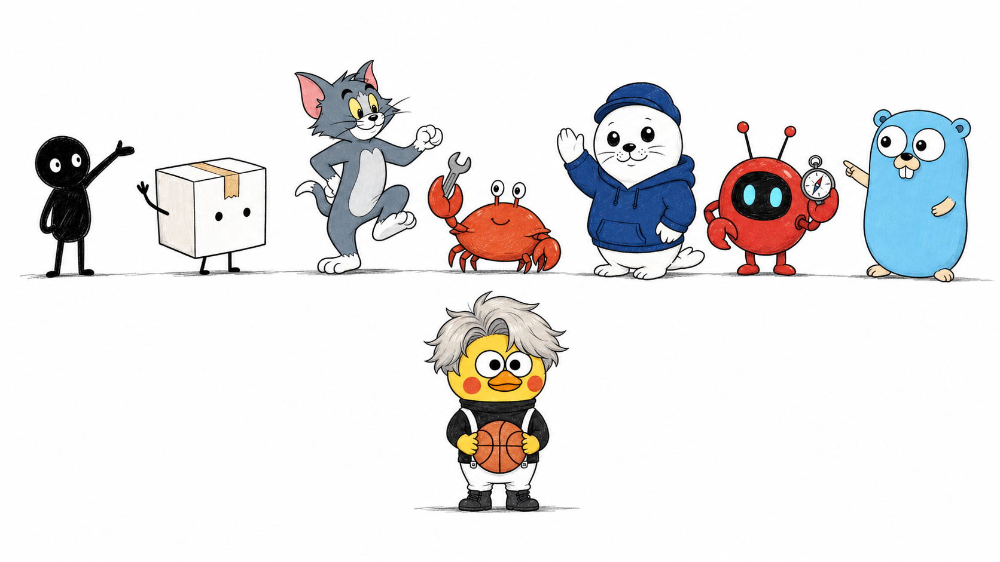

# Visual IP Illustrations



[](https://skills.sh/yangchuansheng/visual-ip-illustrations)

> Visual IP Illustrations é uma Codex Skill multi-IP visual para ilustrações no corpo de artigos. Xiaohei é a rota padrão implícita; Littlebox é explícita e ativa; Tom é uma rota explícita de personagem protegido com status `gated-authorized`; Ferris é uma rota explícita de mascote da comunidade Rust com status `source-reviewed`; Seal é uma rota explícita de foca com moletom, neutra em relação a produto, com status `active`; OpenClaw é uma rota explícita de logo-mascote com status `source-reviewed`. Go Gopher is an explicit source-reviewed article-illustration mascot route with output path `assets/<article-slug>-gopher/`. Cai Xukun is an explicit `gated-public-figure` stylized mascot-only route with aliases `蔡徐坤`, `caixukun`, and `cxk`, source pointer `skills/visual-ip-illustrations/references/ips/caixukun/source.md`, output path `assets/<article-slug>-caixukun/`, uploaded-image authority, public-figure likeness boundary, source-image context boundary, public sample review gate, route isolation, and safety review for endorsement, affiliation, impersonation, campaign, advertising, and fandom-promotion claims.
>
> 16:9 horizontal | múltiplas IPs visuais | ilustrações para corpo de artigo | Invocação canônica: `$visual-ip-illustrations`

<!-- README-I18N:START -->

[English](../README.md) | [Español](./README.es.md) | **Português** | [Deutsch](./README.de.md) | [Français](./README.fr.md) | [简体中文](./README.zh.md) | [繁體中文](./README.zh-Hant.md) | [한국어](./README.ko.md) | [日本語](./README.ja.md) | [العربية](./README.ar.md) | [Русский](./README.ru.md) | [Українська](./README.uk.md) | [Türkçe](./README.tr.md)

<!-- README-I18N:END -->

---

## O que é este repositório

Visual IP Illustrations orienta um agente de IA a criar ilustrações de corpo para artigos, posts, blogs, documentos Notion e escrita metodológica.

A skill lê a âncora cognitiva no texto de origem e transforma um julgamento, workflow, estrutura, estado ou metáfora em uma imagem explicativa memorável, desenhada à mão em 16:9.

Inventário atual de rotas:

- **Xiaohei**: rota padrão implícita. Quando o usuário omite uma IP visual, a skill usa Xiaohei e preserva a experiência de ilustração desenhada à mão sobre fundo branco.
- **Littlebox**: rota explícita ativa. Solicitações que citam `小盒`, `Littlebox`, `纸盒`, `paper-box` ou `carton` usam a rota Littlebox.
- **Tom**: rota explícita de personagem protegido. Solicitações que citam `Tom`, `Tom Cat`, `Tom and Jerry`, `汤姆` ou `汤姆猫` usam a rota Tom.
- **Ferris**: rota explícita de mascote da comunidade Rust. Solicitações que citam `Ferris`, `Rust mascot`, `Rust crab`, `Rustacean`, `Rust 吉祥物` ou `Rust 螃蟹` usam a rota Ferris.
- **Seal**: rota explícita de foca com moletom, neutra em relação a produto. Solicitações que citam `Seal`, `hoodie seal`, `white seal`, `blue hoodie seal`, `海豹`, `连帽衫海豹`, `白色海豹` ou `蓝色连帽衫海豹` usam a rota Seal.
- **OpenClaw**: explicit logo-mascot route with status `source-reviewed`. Requests that name `OpenClaw`, `openclaw`, `OpenClaw logo`, `OpenClaw mascot`, or the OpenClaw aliases listed in `skills/visual-ip-illustrations/references/routing.md` use the OpenClaw route.
- **Go Gopher**: explicit source-reviewed article-illustration mascot route. Requests that name `Go Gopher`, `Gopher`, `golang gopher`, `Go mascot`, `Go 吉祥物`, `Gopher 吉祥物`, or Go Gopher aliases listed in `skills/visual-ip-illustrations/references/routing.md` use the Go Gopher route.
- **Cai Xukun**: explicit `gated-public-figure` stylized mascot-only route. Requests that name `Cai Xukun`, `蔡徐坤`, `caixukun`, or `cxk` use the Cai Xukun route with uploaded-image authority, public-figure likeness boundary, source-image context boundary, public sample review gate, route isolation, source pointer `skills/visual-ip-illustrations/references/ips/caixukun/source.md`, output path `assets/<article-slug>-caixukun/`, and safety review for endorsement, affiliation, impersonation, campaign, advertising, and fandom-promotion claims.

Valor central: usuários podem escolher uma IP visual e receber assets de ilustração de artigo cujos personagens, regras de estilo, prompts, gates de QA, saídas salvas, atribuição, contexto de origem e limite de marca permanecem consistentes com essa IP.

A identidade pública da Release 1.4 usa `Visual IP Illustrations`, o slug canônico de checkout local `visual-ip-illustrations` e a invocação canônica `$visual-ip-illustrations`. As superfícies de compatibilidade seguem estáveis: diretório instalável `skills/visual-ip-illustrations/`, alias legacy `$ian-xiaohei-illustrations`, rotas fonte existentes `skills/visual-ip-illustrations/`, comportamento de rotas, diretórios de saída e marcadores do validador.

---

## Para quem é

- Escritores que precisam de ilustrações de corpo para conceitos de artigos.
- Pensadores de produto e autores de metodologia que querem metáforas visuais claras.
- Autores de workflows de IA que precisam de prompts reutilizáveis de linguagem visual.
- Usuários de Codex que querem um pacote skill multi-IP estável.

## Saídas

- Uma shot list de 4 a 8 imagens para um artigo.
- Para cada imagem: posição, tema, ideia central, tipo de estrutura, ação do personagem e rótulos visíveis sugeridos.
- Imagens PNG finais.
- Xiaohei grava saídas em `assets/<article-slug>-illustrations/` no workspace.
- Littlebox grava saídas em `assets/<article-slug>-littlebox/` no workspace.
- Tom grava saídas em `assets/<article-slug>-tom/` no workspace.
- Ferris grava saídas em `assets/<article-slug>-ferris/` no workspace.
- Seal grava saídas em `assets/<article-slug>-seal/` no workspace.
- OpenClaw grava outputs no workspace path `assets/<article-slug>-openclaw/`.
- Go Gopher outputs to workspace path `assets/<article-slug>-gopher/`.
- Cai Xukun outputs to workspace path `assets/<article-slug>-caixukun/`.

A validação de docs também preserva marcadores de rota escapados em HTML: `assets/&lt;article-slug&gt;-illustrations/`, `assets/&lt;article-slug&gt;-littlebox/`, `assets/&lt;article-slug&gt;-tom/`, `assets/&lt;article-slug&gt;-ferris/`, `assets/&lt;article-slug&gt;-seal/` e `assets/&lt;article-slug&gt;-openclaw/`.
Docs validation also keeps Go Gopher escaped marker: `assets/&lt;article-slug&gt;-gopher/`.
Docs validation also keeps Cai Xukun escaped marker: `assets/&lt;article-slug&gt;-caixukun/`.

---

## Rotas de IP visual

### Xiaohei

Xiaohei é a rota padrão: uma figura preta sólida com olhos de ponto, pernas finas e expressão neutra, realizando ativamente uma ação cognitiva estranha e legível sobre fundo branco puro. Funciona bem para julgamentos, workflows, pontos de ruptura, armadilhas, rotas de passagem e vistas locais de sistemas.

Alias: `小黑`, `Xiaohei`, `Ian`, `ian-xiaohei`.

### Littlebox

Littlebox é uma rota explícita: um personagem de caixa de papel fechada com linhas pretas ásperas de marcador, fundo azul-céu claro ou lavanda claro, fita âmbar e acentos coral esparsos. Traduz uma ação cognitiva em coletar, empacotar, ordenar, entregar, bloquear ou reparar.

Alias: `小盒`, `Littlebox`, `纸盒`, `paper-box`, `carton`.

### Tom

Tom é uma rota explícita de personagem protegido: o conhecido gato azul-acinzentado carrega um conceito de artigo por meio de uma ação cômica ativa dentro do limite de direitos da rota. Funciona bem para lógica de perseguição, armadilhas, atalhos falhos, planos frágeis, reversões, problemas de timing e sequências de causa e efeito em estilo cartoon.

Alias: `Tom`, `Tom Cat`, `Tom and Jerry`, `汤姆`, `汤姆猫`.

### Ferris

Ferris é uma rota explícita de mascote da comunidade Rust: um mascote compacto de caranguejo laranja realiza a ação cognitiva central construindo, ordenando, protegendo, levantando, conectando ou reparando com cuidado. Funciona bem para pensamento sistêmico, confiabilidade, ownership, fluxos tipo compilação, revisão de tradeoffs, checagens de limites e metáforas de objetos Rust de baixa tecnologia.

Alias: `Ferris`, `Rust mascot`, `Rust crab`, `Rustacean`, `Rust 吉祥物`, `Rust 螃蟹`.

### Seal

Seal é uma rota explícita de foca com moletom, neutra em relação a produto: uma foca branca e arredondada com boné azul-marinho liso e moletom azul profundo liso realiza o julgamento, sequência, passagem, comparação ou reparo central do artigo. Funciona bem para revisão, priorização, consciência de histórico de origem, cenários sem logos e metáforas de artigo de baixa tecnologia.

Alias: `Seal`, `hoodie seal`, `white seal`, `blue hoodie seal`, `海豹`, `连帽衫海豹`, `白色海豹`, `蓝色连帽衫海豹`.

### OpenClaw

OpenClaw é uma rota explícita de logo-mascote: o personagem oficial vermelho e redondo do logo OpenClaw representa um conceito de artigo por ações amigáveis de inspecionar, segurar, construir pontes, ordenar, levantar ou sinalizar. Funciona bem para clareza de workflow, verificações de compatibilidade, coordenação modelo/ferramenta, portões de revisão e metáforas de projeto source-reviewed.

Alias: `OpenClaw`, `openclaw`, `OpenClaw logo`, `OpenClaw mascot`, além dos aliases OpenClaw listados em `skills/visual-ip-illustrations/references/routing.md`.

### Go Gopher

Go Gopher is an explicit source-reviewed article-illustration mascot route: the Go language mascot from route-local `skills/visual-ip-illustrations/references/ips/gopher/gopher.png` carries one article concept through sparse, hand-drawn cognitive actions while preserving the Go blog source context, Renee French attribution, Creative Commons Attribution 4.0 boundary, Go logo boundary, official endorsement boundary, and public sample gate.

Aliases: `Go Gopher`, `Gopher`, `golang gopher`, `Go mascot`, plus Go Gopher aliases listed in `skills/visual-ip-illustrations/references/routing.md`.

### Cai Xukun

Cai Xukun is an explicit `gated-public-figure` stylized mascot-only route. The uploaded reference images are the uploaded-image authority for a sparse article-illustration mascot, with public-figure likeness boundary, source-image context boundary, public sample review gate, route isolation, and stylized mascot-only output. Public docs use source pointer `skills/visual-ip-illustrations/references/ips/caixukun/source.md` and output path `assets/<article-slug>-caixukun/`.

Aliases: `Cai Xukun`, `蔡徐坤`, `caixukun`, `cxk`.

Safety boundary: generated text and release copy must keep endorsement, affiliation, impersonation, campaign, advertising, and fandom-promotion claims inside maintainer review and rewrite them as neutral article-concept labels.

### Referência de rotas

Mantenedores podem revisar os campos de metadata de rota em `skills/visual-ip-illustrations/references/routing.md`: `id`, `display_name`, `aliases`, `default`, `output_suffix`, `required_references`, `attribution_context` e `status`.

Packs canônicos:

- Xiaohei: `skills/visual-ip-illustrations/references/ips/xiaohei/`
- Littlebox: `skills/visual-ip-illustrations/references/ips/littlebox/`
- Tom: `skills/visual-ip-illustrations/references/ips/tom/`, core entry `index.md`, rights boundary `skills/visual-ip-illustrations/references/ips/tom/rights.md`
- Ferris: `skills/visual-ip-illustrations/references/ips/ferris/`, source/trademark authority `skills/visual-ip-illustrations/references/ips/ferris/source.md`
- Seal: `skills/visual-ip-illustrations/references/ips/seal/`, source-history authority `skills/visual-ip-illustrations/references/ips/seal/source.md`
- OpenClaw: `skills/visual-ip-illustrations/references/ips/openclaw/`, source/license authority `skills/visual-ip-illustrations/references/ips/openclaw/source.md`
- Go Gopher: `skills/visual-ip-illustrations/references/ips/gopher/`, source/license authority `skills/visual-ip-illustrations/references/ips/gopher/source.md`
- Cai Xukun: `skills/visual-ip-illustrations/references/ips/caixukun/`, source authority `skills/visual-ip-illustrations/references/ips/caixukun/source.md`

Quando uma solicitação pede múltiplas IPs visuais, entregue grupos de variantes separados e grave cada grupo em seu próprio diretório de saída. OpenClaw mantém seu próprio grupo de rota, referências locais de rota e diretório de saída.

Dados operacionais da rota:

- Tom: status `gated-authorized`; rights boundary `skills/visual-ip-illustrations/references/ips/tom/rights.md`; output path `assets/<article-slug>-tom/`; docs validation token `assets/&lt;article-slug&gt;-tom/`; output suffix `tom`; public rendered samples require the `RELEASE_CHECKLIST.md` public-sample gate and Tom rights record approval.
- Ferris: status `source-reviewed`; source/trademark authority `skills/visual-ip-illustrations/references/ips/ferris/source.md`; output path `assets/<article-slug>-ferris/`; docs validation token `assets/&lt;article-slug&gt;-ferris/`; output suffix `ferris`; public rendered samples require the `RELEASE_CHECKLIST.md` Rust trademark and endorsement-safe wording gate. Ferris is an explicit Rust-community mascot route with status source-reviewed; generated public Ferris samples require release review for Rust trademark and endorsement-safe wording.
- Seal: route id `seal`; default=false; status `active`; source-history authority `skills/visual-ip-illustrations/references/ips/seal/source.md`; output path `assets/<article-slug>-seal/`; docs validation token `assets/&lt;article-slug&gt;-seal/`; output suffix `seal`; hoodie seal identity uses a white rounded seal body, plain navy cap, plain deep-blue hoodie, glossy dark eyes, black nose, whisker dots, small smile, short rounded flippers, compact legs, and side-rear white tail; logo-free boundary keeps cap, hoodie chest, mascot body, props, and scene plain and mark-free; product-neutral route isolation keeps Seal separate from product-brand routes; source-history attachment stays required; public rendered samples require release gates for hoodie seal identity, logo-free output, product-neutral route isolation, source-history attachment, and article-metaphor quality.
- OpenClaw: route id `openclaw`; default=false; status `source-reviewed`; source/license authority `skills/visual-ip-illustrations/references/ips/openclaw/source.md`; output path `assets/<article-slug>-openclaw/`; docs validation token `assets/&lt;article-slug&gt;-openclaw/`; output suffix `openclaw`; uploaded-logo identity uses a red round body, side claw-like arms, two antennae, black eyes, cyan pupils, and short legs; public rendered samples require the `RELEASE_CHECKLIST.md` public-sample gate and final OpenClaw release evidence.
- Go Gopher: route id `gopher`; default=false; status `source-reviewed`; source/license authority `skills/visual-ip-illustrations/references/ips/gopher/source.md`; output path `assets/<article-slug>-gopher/`; docs validation token `assets/&lt;article-slug&gt;-gopher/`; output suffix `gopher`; local visual authority route-local `skills/visual-ip-illustrations/references/ips/gopher/gopher.png`; attribution Renee French; license boundary Creative Commons Attribution 4.0; public rendered samples require the `RELEASE_CHECKLIST.md` public-sample gate and Phase 42 Go Gopher release evidence; Go logo boundary and official endorsement boundary stay attached.
- Cai Xukun: route id `caixukun`; default=false; status `gated-public-figure`; source authority `skills/visual-ip-illustrations/references/ips/caixukun/source.md`; output path `assets/<article-slug>-caixukun/`; docs validation token `assets/&lt;article-slug&gt;-caixukun/`; output suffix `caixukun`; aliases `Cai Xukun`, `蔡徐坤`, `caixukun`, and `cxk`; uploaded-image authority and source-image context boundary stay attached; public-figure likeness boundary keeps the route in stylized mascot-only output; route isolation keeps Cai Xukun separate from Xiaohei, Littlebox, Tom, Ferris, Seal, OpenClaw, and Go Gopher; public generated sample assets are approved for the Trust Bridge public README gallery through the public sample review gate; endorsement, affiliation, impersonation, campaign, advertising, and fandom-promotion claims require maintainer review and neutral article-concept wording.

---

## Galeria de exemplos

These images are approved public English calibration examples for the current visual IP routes with approved public sample assets: Xiaohei, Littlebox, Tom, Ferris, Seal, OpenClaw, Go Gopher, and Cai Xukun. Cai Xukun currently appears in the Trust Bridge row through the public sample review gate. Each row keeps the same concept and shows how each approved public-sample IP translates the action through its route-local style, character rules, source boundaries, and QA gates.

### Two Breakpoints

| Xiaohei | Littlebox | Tom | Ferris | Seal | OpenClaw | Go Gopher |
|---------|-----------|-----|--------|------|----------|-----------|
|  |  |  |  |  |  |  |

### Sort by Purpose

| Xiaohei | Littlebox | Tom | Ferris | Seal | OpenClaw | Go Gopher |
|---------|-----------|-----|--------|------|----------|-----------|
|  |  |  |  |  |  |  |

### One Fish, Many Uses

| Xiaohei | Littlebox | Tom | Ferris | Seal | OpenClaw | Go Gopher |
|---------|-----------|-----|--------|------|----------|-----------|
|  |  |  |  |  |  |  |

### Handoff Path

| Xiaohei | Littlebox | Tom | Ferris | Seal | OpenClaw | Go Gopher |
|---------|-----------|-----|--------|------|----------|-----------|
|  |  |  |  |  |  |  |

### Information Well

| Xiaohei | Littlebox | Tom | Ferris | Seal | OpenClaw | Go Gopher |
|---------|-----------|-----|--------|------|----------|-----------|
|  |  |  |  |  |  |  |

### Idea Press

| Xiaohei | Littlebox | Tom | Ferris | Seal | OpenClaw | Go Gopher |
|---------|-----------|-----|--------|------|----------|-----------|
|  |  |  |  |  |  |  |

### Content Fermentation

| Xiaohei | Littlebox | Tom | Ferris | Seal | OpenClaw | Go Gopher |
|---------|-----------|-----|--------|------|----------|-----------|
|  |  |  |  |  |  |  |

### Trust Bridge

| Xiaohei | Littlebox | Tom | Ferris | Seal | OpenClaw | Go Gopher | Cai Xukun |
|---------|-----------|-----|--------|------|----------|-----------|-----------|
|  |  |  |  |  |  |  |  |

---

## Instalação

Instale com a CLI skills:

```bash
npx skills add yangchuansheng/visual-ip-illustrations --skill visual-ip-illustrations
```

Instalação manual do Codex:

```bash
git clone https://github.com/yangchuansheng/visual-ip-illustrations.git visual-ip-illustrations
cd visual-ip-illustrations
mkdir -p "${CODEX_HOME:-$HOME/.codex}/skills"
cp -R ./skills/visual-ip-illustrations "${CODEX_HOME:-$HOME/.codex}/skills/"
```

Após a instalação, prefira `$visual-ip-illustrations` no Codex.

Compatibilidade da Release 1.4:

- Invocação pública canônica: `$visual-ip-illustrations`
- Alias legacy de compatibilidade: `$ian-xiaohei-illustrations`
- Diretório instalável da skill: `skills/visual-ip-illustrations/`
- Remote vivo atual do repositório: `https://github.com/yangchuansheng/visual-ip-illustrations.git`
- Diretório local de checkout: `visual-ip-illustrations`
- O comportamento das rotas e os diretórios de saída permanecem estáveis nas duas superfícies de invocação.

---

## Exemplos rápidos

`{visual IP}` pode ser `Xiaohei`, `Littlebox`, `Tom`, `Ferris`, `Seal`, `OpenClaw`, `Go Gopher`, `Cai Xukun` ou um alias compatível. IP visual omitido seleciona Xiaohei.

### Planejar uma shot list

```text
Use $visual-ip-illustrations. Do not generate images yet.
Use {visual IP} to create a 5-image article body illustration shot list for the article below.
For each image, include placement, theme, core idea, structure type, character action, and suggested visible labels in the user's language.

<paste article>
```

### Gerar ilustrações de corpo

```text
Use $visual-ip-illustrations with {visual IP} to generate 4 article body illustrations for the article below.
Each image should express one core idea, and the selected character must carry the action.
Use the selected IP's route-local references, QA checklist, and output path.

<paste article>
```

### Ideia única

```text
Use $visual-ip-illustrations with {visual IP} to generate one 16:9 article body illustration.
Idea: trust is built by placing one piece of evidence after another.
Requirements: hand-drawn, spacious, sparse visible labels in the user's language, and the character performing the central action.
```

### Comparação de IP

```text
Use $visual-ip-illustrations. Do not generate images yet.
Create separate Xiaohei, Littlebox, Tom, Ferris, Seal, OpenClaw, Go Gopher, and Cai Xukun shot-list groups from the same idea.
Each group must keep its own IP, character action, visible labels, and output path.

Idea: trust is built by placing one piece of evidence after another.
```

As rotas protected-character, source-reviewed e active source-history carregam automaticamente status de rota, nota de source/rights, release gate e diretório de saída específico; OpenClaw carrega source/license authority, uploaded-logo identity, public-sample gate e `assets/<article-slug>-openclaw/`.

Há mais exemplos copiáveis em [examples/prompts.md](../examples/prompts.md).

---

## Fluxo de trabalho

1. Leia o artigo, Markdown, conteúdo do Notion, captura ou tópico fornecido pelo usuário.
2. Selecione a IP visual: IP omitida seleciona Xiaohei; Littlebox explícito seleciona Littlebox; aliases Tom selecionam a rota protected-character de Tom; aliases Ferris selecionam o pack source-reviewed de Ferris; aliases Seal selecionam o pack ativo de Seal; aliases OpenClaw explícitos selecionam o pack source-reviewed de OpenClaw. Explicit Go Gopher aliases select the Go Gopher source-reviewed pack. Explicit Cai Xukun aliases select the Cai Xukun gated-public-figure pack.
3. Extraia afirmações centrais, viradas cognitivas, estruturas de workflow e parágrafos visualizáveis.
4. Produza uma shot list primeiro; cada imagem recebe uma âncora cognitiva.
5. Escolha um tipo de estrutura por imagem: Workflow, vista local de sistema, antes/depois, estado de personagem, metáfora conceitual, camadas de método, rota de mapa ou painéis de quadrinhos.
6. Carregue o pack canônico da IP selecionada, monte prompts e gere imagens uma por uma. Solicitações multi-IP criam grupos de rota e diretórios de saída separados, com Xiaohei, Littlebox, Tom, Ferris e Seal mantendo referências locais de rota; OpenClaw também mantém referências locais de rota. Go Gopher plans keep the Go language mascot action-centered and route-local.
7. Verifique identidade do personagem, composição, fundo, rótulos e caminho de saída com a checklist de QA da IP selecionada. Tom mantém `gated-authorized` e `skills/visual-ip-illustrations/references/ips/tom/rights.md`; Ferris mantém `source-reviewed`, nota de fonte/marca e `skills/visual-ip-illustrations/references/ips/ferris/source.md`; Seal mantém `active`, autoridade de source-history, nota de identidade hoodie seal, nota logo-free e `skills/visual-ip-illustrations/references/ips/seal/source.md`; OpenClaw mantém `source-reviewed`, source/license authority, uploaded-logo identity, public-sample gate e `skills/visual-ip-illustrations/references/ips/openclaw/source.md`. Go Gopher keeps `source-reviewed`, source/license authority, route-local `skills/visual-ip-illustrations/references/ips/gopher/gopher.png`, public-sample gate, and `references/ips/gopher/source.md` in the delivery notes. Cai Xukun keeps `gated-public-figure`, uploaded-image authority, public-figure likeness boundary, source-image context boundary, public sample review gate, route isolation, stylized mascot-only output, `skills/visual-ip-illustrations/references/ips/caixukun/source.md`, and `assets/<article-slug>-caixukun/` in the delivery notes.
8. Salve os PNGs finais e reporte propósito mais caminho.

---

## Estrutura de diretórios

```text
.
├── README.md
├── readmes/
│   ├── README.es.md
│   ├── README.pt.md
│   ├── README.de.md
│   ├── README.fr.md
│   ├── README.zh.md
│   ├── README.zh-Hant.md
│   ├── README.ko.md
│   ├── README.ja.md
│   ├── README.ar.md
│   ├── README.ru.md
│   ├── README.uk.md
│   └── README.tr.md
├── LICENSE
├── NOTICE.md
├── examples/
│   ├── images/
│   │   ├── 01-two-breakpoints.png
│   │   ├── 02-sort-by-purpose.png
│   │   └── ...
│   └── prompts.md
└── skills/
    └── visual-ip-illustrations/
        ├── SKILL.md
        ├── agents/
        │   └── openai.yaml
        ├── assets/
        │   └── examples/
        └── references/
            ├── routing.md
            ├── style-dna.md
            ├── xiaohei-ip.md
            ├── composition-patterns.md
            ├── prompt-template.md
            ├── qa-checklist.md
            └── ips/
                ├── xiaohei/
                │   ├── index.md
                │   ├── style-dna.md
                │   ├── xiaohei-ip.md
                │   ├── composition-patterns.md
                │   ├── prompt-template.md
                │   └── qa-checklist.md
                ├── littlebox/
                │   ├── index.md
                │   ├── style-dna.md
                │   ├── littlebox-ip.md
                │   ├── composition-patterns.md
                │   ├── language-and-labels.md
                │   ├── prompt-template.md
                │   └── qa-checklist.md
                ├── tom/
                │   ├── index.md
                │   ├── rights.md
                │   ├── style-dna.md
                │   ├── tom-ip.md
                │   ├── composition-patterns.md
                │   ├── prompt-template.md
                │   └── qa-checklist.md
                ├── ferris/
                │   ├── index.md
                │   ├── source.md
                │   ├── style-dna.md
                │   ├── ferris-ip.md
                │   ├── composition-patterns.md
                │   ├── prompt-template.md
                │   └── qa-checklist.md
                ├── seal/
                │   ├── index.md
                │   ├── source.md
                │   ├── style-dna.md
                │   ├── seal-ip.md
                │   ├── composition-patterns.md
                │   ├── prompt-template.md
                │   └── qa-checklist.md
                ├── openclaw/
                │   ├── index.md
                │   ├── source.md
                │   ├── style-dna.md
                │   ├── openclaw-ip.md
                │   ├── composition-patterns.md
                │   ├── prompt-template.md
                │   └── qa-checklist.md
                ├── gopher/
                │   ├── index.md
                │   ├── source.md
                │   ├── style-dna.md
                │   ├── gopher-ip.md
                │   ├── composition-patterns.md
                │   ├── prompt-template.md
                │   └── qa-checklist.md
                └── caixukun/
                    ├── index.md
                    ├── source.md
                    ├── style-dna.md
                    ├── caixukun-ip.md
                    ├── composition-patterns.md
                    ├── prompt-template.md
                    └── qa-checklist.md
```

O destino de instalação do Codex é este subdiretório:

```text
skills/visual-ip-illustrations/
```

O README raiz, LICENSE, NOTICE e examples são docs de distribuição no GitHub.

---

## Validação para mantenedores

```bash
node scripts/validate-skill-package.mjs
```

A validação cobre skill package shape, route table, packs canônicos de Xiaohei, Littlebox, Tom, Ferris e Seal, legacy Xiaohei paths, public docs links, output path markers, NOTICE attribution, Tom `gated-authorized` route markers, Ferris `source-reviewed` route markers, Seal `active` route markers, source-history authority, hoodie seal identity note, logo-free note e Phase 32 full validator restoration evidence.

A validação também cobre OpenClaw canonical pack markers, OpenClaw `source-reviewed` route markers, source/license authority, uploaded-logo identity note e Phase 37 final release evidence.
Validation also covers Go Gopher canonical pack markers, Go Gopher `source-reviewed` route markers, source/license authority, route-local `skills/visual-ip-illustrations/references/ips/gopher/gopher.png`, public sample gate, Phase 42 final release evidence, and Go Gopher validator checks. Phase 46 public docs cover Cai Xukun canonical pack markers, Cai Xukun `gated-public-figure` route markers, source authority `skills/visual-ip-illustrations/references/ips/caixukun/source.md`, uploaded-image authority, public-figure likeness boundary, source-image context boundary, public sample review gate, route isolation, stylized mascot-only output, `assets/<article-slug>-caixukun/`, `assets/&lt;article-slug&gt;-caixukun/`, and endorsement, affiliation, impersonation, campaign, advertising, and fandom-promotion review terms; Phase 47 owns validator hardening and final release evidence.

Comandos atuais de validação para mantenedores:

```bash
node scripts/validate-skill-package.mjs
node --test scripts/validate-skill-package.test.mjs
git diff --check
```

As verificações pré-release estão em [RELEASE_CHECKLIST.md](../RELEASE_CHECKLIST.md).

---

---

## Licença

MIT License. Consulte [LICENSE](../LICENSE).
