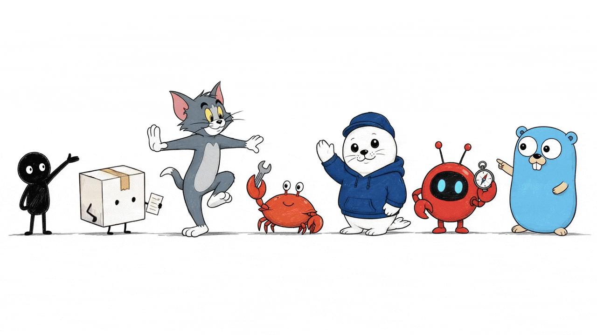

# Visual IP Illustrations



[](https://skills.sh/yangchuansheng/visual-ip-illustrations)

> Visual IP Illustrations 是一個用於文章正文配圖的多視覺 IP Codex Skill。Xiaohei 是隱式預設路線；Littlebox 是顯式且 active 的路線；Tom 是顯式 protected-character 路線，狀態為 `gated-authorized`；Ferris 是顯式 Rust-community mascot 路線，狀態為 `source-reviewed`；Seal 是顯式 product-neutral hoodie seal 路線，狀態為 `active`；OpenClaw 是顯式 logo-mascot 路線，狀態為 `source-reviewed`。 Go Gopher is an explicit source-reviewed article-illustration mascot route with output path `assets/<article-slug>-gopher/`. Cai Xukun is an explicit `gated-public-figure` stylized mascot-only route with aliases `蔡徐坤`, `caixukun`, and `cxk`, source pointer `skills/visual-ip-illustrations/references/ips/caixukun/source.md`, output path `assets/<article-slug>-caixukun/`, uploaded-image authority, public-figure likeness boundary, source-image context boundary, public sample review gate, route isolation, and safety review for endorsement, affiliation, impersonation, campaign, advertising, and fandom-promotion claims.
>
> 16:9 橫圖 | 多視覺 IP | 文章正文配圖 | 標準呼叫方式：`$visual-ip-illustrations`

<!-- README-I18N:START -->

[English](../README.md) | [Español](./README.es.md) | [Português](./README.pt.md) | [Deutsch](./README.de.md) | [Français](./README.fr.md) | [简体中文](./README.zh.md) | **繁體中文** | [한국어](./README.ko.md) | [日本語](./README.ja.md) | [العربية](./README.ar.md) | [Русский](./README.ru.md) | [Українська](./README.uk.md) | [Türkçe](./README.tr.md)

<!-- README-I18N:END -->

---

## 這個倉庫是什麼

Visual IP Illustrations 引導 AI agent 為文章、貼文、部落格、Notion 文件和方法論寫作建立正文配圖。

這個 skill 會讀取來源文字裡的認知錨點，再把一個判斷、工作流、結構、狀態或隱喻轉化為一張易記的 16:9 手繪解釋圖。

目前路線清單：

- **Xiaohei**：implicit default route。使用者省略 visual IP 時，skill 使用 Xiaohei，並保留白底手繪文章插圖體驗。
- **Littlebox**：explicit active route。提到 `小盒`、`Littlebox`、`纸盒`、`paper-box` 或 `carton` 的請求使用 Littlebox route。
- **Tom**：explicit protected-character route。提到 `Tom`、`Tom Cat`、`Tom and Jerry`、`汤姆` 或 `汤姆猫` 的請求使用 Tom route。
- **Ferris**：explicit Rust-community mascot route。提到 `Ferris`、`Rust mascot`、`Rust crab`、`Rustacean`、`Rust 吉祥物` 或 `Rust 螃蟹` 的請求使用 Ferris route。
- **Seal**：explicit product-neutral hoodie seal route。提到 `Seal`、`hoodie seal`、`white seal`、`blue hoodie seal`、`海豹`、`连帽衫海豹`、`白色海豹` 或 `蓝色连帽衫海豹` 的請求使用 Seal route。
- **OpenClaw**：顯式 logo-mascot 路線，狀態為 `source-reviewed`。提到 `OpenClaw`、`openclaw`、`OpenClaw logo`、`OpenClaw mascot` 或 `skills/visual-ip-illustrations/references/routing.md` 中列出的 OpenClaw aliases 時使用 OpenClaw route。
- **Go Gopher**: explicit source-reviewed article-illustration mascot route. Requests that name `Go Gopher`, `Gopher`, `golang gopher`, `Go mascot`, `Go 吉祥物`, `Gopher 吉祥物`, or Go Gopher aliases listed in `skills/visual-ip-illustrations/references/routing.md` use the Go Gopher route.
- **Cai Xukun**: explicit `gated-public-figure` stylized mascot-only route. Requests that name `Cai Xukun`, `蔡徐坤`, `caixukun`, or `cxk` use the Cai Xukun route with uploaded-image authority, public-figure likeness boundary, source-image context boundary, public sample review gate, route isolation, source pointer `skills/visual-ip-illustrations/references/ips/caixukun/source.md`, output path `assets/<article-slug>-caixukun/`, and safety review for endorsement, affiliation, impersonation, campaign, advertising, and fandom-promotion claims.

核心價值：使用者可以選擇一個視覺 IP，並得到在角色、風格規則、提示詞、QA 門檻、儲存輸出、署名、來源上下文和品牌邊界上都與該 IP 保持一致的文章配圖資產。

Release 1.4 的公開身份使用 `Visual IP Illustrations`、本地 checkout 的 canonical slug `visual-ip-illustrations`，以及 canonical invocation `$visual-ip-illustrations`。相容性表面保持穩定：可安裝目錄 `skills/visual-ip-illustrations/`、legacy alias `$ian-xiaohei-illustrations`、現有來源路徑 `skills/visual-ip-illustrations/`、路由行為、輸出目錄與 validator markers。

---

## 適合誰

- 需要文章正文插圖來表達文章概念的寫作者。
- 需要清晰視覺隱喻的產品思考者與方法論作者。
- 需要可重用視覺語言 prompts 的 AI workflow 作者。
- 需要穩定 multi-IP skill package 的 Codex 使用者。

## 輸出

- 一份 4 到 8 張圖的文章 shot list。
- 每張圖包含：位置、主題、核心想法、結構類型、角色動作與建議可見標籤。
- 最終 PNG 圖像。
- Xiaohei 輸出到 workspace path `assets/<article-slug>-illustrations/`。
- Littlebox 輸出到 workspace path `assets/<article-slug>-littlebox/`。
- Tom 輸出到 workspace path `assets/<article-slug>-tom/`。
- Ferris 輸出到 workspace path `assets/<article-slug>-ferris/`。
- Seal 輸出到 workspace path `assets/<article-slug>-seal/`。
- OpenClaw 輸出到 workspace path `assets/<article-slug>-openclaw/`。
- Go Gopher outputs to workspace path `assets/<article-slug>-gopher/`.
- Cai Xukun outputs to workspace path `assets/<article-slug>-caixukun/`.

Docs validation 也保留 HTML escaped route markers：`assets/&lt;article-slug&gt;-illustrations/`、`assets/&lt;article-slug&gt;-littlebox/`、`assets/&lt;article-slug&gt;-tom/`、`assets/&lt;article-slug&gt;-ferris/`、`assets/&lt;article-slug&gt;-seal/` 和 `assets/&lt;article-slug&gt;-openclaw/`。
Docs validation also keeps Go Gopher escaped marker: `assets/&lt;article-slug&gt;-gopher/`.
Docs validation also keeps Cai Xukun escaped marker: `assets/&lt;article-slug&gt;-caixukun/`.

---

## 視覺 IP 路線

### Xiaohei

Xiaohei 是預設路由：一個黑色實心小人，有點狀眼睛、細腿與中性表情，在純白背景上主動完成一個奇特但清晰的認知動作。它適合判斷、workflow、斷點、陷阱、交接路徑與系統局部視角。

Alias: `小黑`, `Xiaohei`, `Ian`, `ian-xiaohei`.

### Littlebox

Littlebox 是顯式路由：一個封閉紙盒角色，帶有粗糙黑色 marker 線條、淡天藍或淡薰衣草背景、琥珀色膠帶與少量 coral 點綴。它把認知動作轉成收集、打包、整理、交付、阻擋或修復。

Alias: `小盒`, `Littlebox`, `纸盒`, `paper-box`, `carton`.

### Tom

Tom 是顯式 protected-character 路由：熟悉的藍灰色貓透過主動喜劇動作承載文章概念，並遵守該路由的 rights boundary。它適合追逐邏輯、陷阱、失敗捷徑、脆弱計畫、反轉、timing 問題與卡通式因果序列。

Alias: `Tom`, `Tom Cat`, `Tom and Jerry`, `汤姆`, `汤姆猫`.

### Ferris

Ferris 是顯式 Rust community mascot 路由：一隻緊湊的橘色螃蟹 mascot 透過建造、整理、保護、舉起、連接或修復來完成中心認知動作。它適合系統思考、可靠性、ownership、compile-like flows、tradeoff review、邊界檢查與 low-tech Rust object metaphors。

Alias: `Ferris`, `Rust mascot`, `Rust crab`, `Rustacean`, `Rust 吉祥物`, `Rust 螃蟹`.

### Seal

Seal 是顯式 product-neutral hoodie seal 路由：圓潤白色海豹戴素色海軍藍帽、穿素色深藍 hoodie，完成文章的核心判斷、序列、交接、比較或修復。它適合 review、優先級排序、source-history awareness、logo-free 場景與 low-tech 文章隱喻。

Alias: `Seal`, `hoodie seal`, `white seal`, `blue hoodie seal`, `海豹`, `连帽衫海豹`, `白色海豹`, `蓝色连帽衫海豹`.

### OpenClaw

OpenClaw 是顯式 logo-mascot 路線：官方紅色圓形 OpenClaw logo 角色會透過友善的檢查、托舉、搭橋、整理、抬起或發信號動作承載一個文章概念。它適合工作流清晰化、相容性檢查、模型/工具協作、評審門檻和 source-reviewed 專案隱喻。

Alias: `OpenClaw`、`openclaw`、`OpenClaw logo`、`OpenClaw mascot`，以及 `skills/visual-ip-illustrations/references/routing.md` 中列出的 OpenClaw aliases。

### Go Gopher

Go Gopher is an explicit source-reviewed article-illustration mascot route: the Go language mascot from route-local `skills/visual-ip-illustrations/references/ips/gopher/gopher.png` carries one article concept through sparse, hand-drawn cognitive actions while preserving the Go blog source context, Renee French attribution, Creative Commons Attribution 4.0 boundary, Go logo boundary, official endorsement boundary, and public sample gate.

Aliases: `Go Gopher`, `Gopher`, `golang gopher`, `Go mascot`, plus Go Gopher aliases listed in `skills/visual-ip-illustrations/references/routing.md`.

### Cai Xukun

Cai Xukun is an explicit `gated-public-figure` stylized mascot-only route. The uploaded reference images are the uploaded-image authority for a sparse article-illustration mascot, with public-figure likeness boundary, source-image context boundary, public sample review gate, route isolation, and stylized mascot-only output. Public docs use source pointer `skills/visual-ip-illustrations/references/ips/caixukun/source.md` and output path `assets/<article-slug>-caixukun/`.

Aliases: `Cai Xukun`, `蔡徐坤`, `caixukun`, `cxk`.

Safety boundary: generated text and release copy must keep endorsement, affiliation, impersonation, campaign, advertising, and fandom-promotion claims inside maintainer review and rewrite them as neutral article-concept labels.

### 路線參考

維護者可以在 `skills/visual-ip-illustrations/references/routing.md` 檢查 route metadata fields：`id`、`display_name`、`aliases`、`default`、`output_suffix`、`required_references`、`attribution_context` 與 `status`。

Canonical packs：

- Xiaohei: `skills/visual-ip-illustrations/references/ips/xiaohei/`
- Littlebox: `skills/visual-ip-illustrations/references/ips/littlebox/`
- Tom: `skills/visual-ip-illustrations/references/ips/tom/`, core entry `index.md`, rights boundary `skills/visual-ip-illustrations/references/ips/tom/rights.md`
- Ferris: `skills/visual-ip-illustrations/references/ips/ferris/`, source/trademark authority `skills/visual-ip-illustrations/references/ips/ferris/source.md`
- Seal: `skills/visual-ip-illustrations/references/ips/seal/`, source-history authority `skills/visual-ip-illustrations/references/ips/seal/source.md`
- OpenClaw: `skills/visual-ip-illustrations/references/ips/openclaw/`, source/license authority `skills/visual-ip-illustrations/references/ips/openclaw/source.md`
- Go Gopher: `skills/visual-ip-illustrations/references/ips/gopher/`, source/license authority `skills/visual-ip-illustrations/references/ips/gopher/source.md`
- Cai Xukun: `skills/visual-ip-illustrations/references/ips/caixukun/`, source authority `skills/visual-ip-illustrations/references/ips/caixukun/source.md`

當請求需要多個 visual IP 時，交付分開的 variant groups，並將每一組寫入自己的輸出目錄。OpenClaw 也保留自己的 route group、route-local references 和 output directory。

Cai Xukun route usage keeps `gated-public-figure`, uploaded-image authority, public-figure likeness boundary, source-image context boundary, public sample review gate, route isolation, stylized mascot-only output, `skills/visual-ip-illustrations/references/ips/caixukun/source.md`, `assets/<article-slug>-caixukun/`, and `assets/&lt;article-slug&gt;-caixukun/` attached to planning, generation, edit, QA, delivery, and release review.

路由操作資料：

- Tom: status `gated-authorized`; rights boundary `skills/visual-ip-illustrations/references/ips/tom/rights.md`; output path `assets/<article-slug>-tom/`; docs validation token `assets/&lt;article-slug&gt;-tom/`; output suffix `tom`; public rendered samples require the `RELEASE_CHECKLIST.md` public-sample gate and Tom rights record approval.
- Ferris: status `source-reviewed`; source/trademark authority `skills/visual-ip-illustrations/references/ips/ferris/source.md`; output path `assets/<article-slug>-ferris/`; docs validation token `assets/&lt;article-slug&gt;-ferris/`; output suffix `ferris`; public rendered samples require the `RELEASE_CHECKLIST.md` Rust trademark and endorsement-safe wording gate. Ferris is an explicit Rust-community mascot route with status source-reviewed; generated public Ferris samples require release review for Rust trademark and endorsement-safe wording.
- Seal: route id `seal`; default=false; status `active`; source-history authority `skills/visual-ip-illustrations/references/ips/seal/source.md`; output path `assets/<article-slug>-seal/`; docs validation token `assets/&lt;article-slug&gt;-seal/`; output suffix `seal`; hoodie seal identity uses a white rounded seal body, plain navy cap, plain deep-blue hoodie, glossy dark eyes, black nose, whisker dots, small smile, short rounded flippers, compact legs, and side-rear white tail; logo-free boundary keeps cap, hoodie chest, mascot body, props, and scene plain and mark-free; product-neutral route isolation keeps Seal separate from product-brand routes; source-history attachment stays required; public rendered samples require release gates for hoodie seal identity, logo-free output, product-neutral route isolation, source-history attachment, and article-metaphor quality.
- OpenClaw: route id `openclaw`; default=false; status `source-reviewed`; source/license authority `skills/visual-ip-illustrations/references/ips/openclaw/source.md`; output path `assets/<article-slug>-openclaw/`; docs validation token `assets/&lt;article-slug&gt;-openclaw/`; output suffix `openclaw`; uploaded-logo identity uses a red round body, side claw-like arms, two antennae, black eyes, cyan pupils, and short legs; public rendered samples require the `RELEASE_CHECKLIST.md` public-sample gate and final OpenClaw release evidence.
- Go Gopher: route id `gopher`; default=false; status `source-reviewed`; source/license authority `skills/visual-ip-illustrations/references/ips/gopher/source.md`; output path `assets/<article-slug>-gopher/`; docs validation token `assets/&lt;article-slug&gt;-gopher/`; output suffix `gopher`; local visual authority route-local `skills/visual-ip-illustrations/references/ips/gopher/gopher.png`; attribution Renee French; license boundary Creative Commons Attribution 4.0; public rendered samples require the `RELEASE_CHECKLIST.md` public-sample gate and Phase 42 Go Gopher release evidence; Go logo boundary and official endorsement boundary stay attached.
- Cai Xukun: route id `caixukun`; default=false; status `gated-public-figure`; source authority `skills/visual-ip-illustrations/references/ips/caixukun/source.md`; output path `assets/<article-slug>-caixukun/`; docs validation token `assets/&lt;article-slug&gt;-caixukun/`; output suffix `caixukun`; aliases `Cai Xukun`, `蔡徐坤`, `caixukun`, and `cxk`; uploaded-image authority and source-image context boundary stay attached; public-figure likeness boundary keeps the route in stylized mascot-only output; route isolation keeps Cai Xukun separate from Xiaohei, Littlebox, Tom, Ferris, Seal, OpenClaw, and Go Gopher; public generated sample assets remain pending behind the public sample review gate; endorsement, affiliation, impersonation, campaign, advertising, and fandom-promotion claims require maintainer review and neutral article-concept wording.

---

## 範例圖庫

These images are approved public English calibration examples for the current visual IP routes with approved public sample assets: Xiaohei, Littlebox, Tom, Ferris, Seal, OpenClaw, and Go Gopher. Cai Xukun is documented as a `gated-public-figure` stylized mascot-only route, and public generated Cai Xukun sample assets remain pending behind the public sample review gate. Each row keeps the same concept and shows how each approved public-sample IP translates the action through its route-local style, character rules, source boundaries, and QA gates.

### Two Breakpoints

| Xiaohei | Littlebox | Tom | Ferris | Seal | OpenClaw | Go Gopher |
|---------|-----------|-----|--------|------|----------|-----------|
|  |  |  |  |  |  |  |

### Sort by Purpose

| Xiaohei | Littlebox | Tom | Ferris | Seal | OpenClaw | Go Gopher |
|---------|-----------|-----|--------|------|----------|-----------|
|  |  |  |  |  |  |  |

### One Fish, Many Uses

| Xiaohei | Littlebox | Tom | Ferris | Seal | OpenClaw | Go Gopher |
|---------|-----------|-----|--------|------|----------|-----------|
|  |  |  |  |  |  |  |

### Handoff Path

| Xiaohei | Littlebox | Tom | Ferris | Seal | OpenClaw | Go Gopher |
|---------|-----------|-----|--------|------|----------|-----------|
|  |  |  |  |  |  |  |

### Information Well

| Xiaohei | Littlebox | Tom | Ferris | Seal | OpenClaw | Go Gopher |
|---------|-----------|-----|--------|------|----------|-----------|
|  |  |  |  |  |  |  |

### Idea Press

| Xiaohei | Littlebox | Tom | Ferris | Seal | OpenClaw | Go Gopher |
|---------|-----------|-----|--------|------|----------|-----------|
|  |  |  |  |  |  |  |

### Content Fermentation

| Xiaohei | Littlebox | Tom | Ferris | Seal | OpenClaw | Go Gopher |
|---------|-----------|-----|--------|------|----------|-----------|
|  |  |  |  |  |  |  |

### Trust Bridge

| Xiaohei | Littlebox | Tom | Ferris | Seal | OpenClaw | Go Gopher |
|---------|-----------|-----|--------|------|----------|-----------|
|  |  |  |  |  |  |  |

---

## 安裝

使用 skills CLI 安裝：

```bash
npx skills add yangchuansheng/visual-ip-illustrations --skill visual-ip-illustrations
```

手動 Codex 安裝：

```bash
git clone https://github.com/yangchuansheng/visual-ip-illustrations.git visual-ip-illustrations
cd visual-ip-illustrations
mkdir -p "${CODEX_HOME:-$HOME/.codex}/skills"
cp -R ./skills/visual-ip-illustrations "${CODEX_HOME:-$HOME/.codex}/skills/"
```

安裝後，在 Codex 中優先使用 `$visual-ip-illustrations`。

Release 1.4 相容性：

- Canonical public invocation：`$visual-ip-illustrations`
- Legacy compatibility alias：`$ian-xiaohei-illustrations`
- Installable skill package directory：`skills/visual-ip-illustrations/`
- Current live repository remote：`https://github.com/yangchuansheng/visual-ip-illustrations.git`
- Local checkout target directory：`visual-ip-illustrations`
- 路由行為與輸出目錄在兩個 invocation surfaces 上保持穩定。

---

## 快速範例

`{visual IP}` 可以是 `Xiaohei`、`Littlebox`、`Tom`、`Ferris`、`Seal`, `OpenClaw`, `Go Gopher` 或支援的別名。省略視覺 IP 時選擇 Xiaohei。

### 規劃 shot list

```text
Use $visual-ip-illustrations. Do not generate images yet.
Use {visual IP} to create a 5-image article body illustration shot list for the article below.
For each image, include placement, theme, core idea, structure type, character action, and suggested visible labels in the user's language.

<paste article>
```

### 生成正文插圖

```text
Use $visual-ip-illustrations with {visual IP} to generate 4 article body illustrations for the article below.
Each image should express one core idea, and the selected character must carry the action.
Use the selected IP's route-local references, QA checklist, and output path.

<paste article>
```

### 單一想法

```text
Use $visual-ip-illustrations with {visual IP} to generate one 16:9 article body illustration.
Idea: trust is built by placing one piece of evidence after another.
Requirements: hand-drawn, spacious, sparse visible labels in the user's language, and the character performing the central action.
```

### IP 比較

```text
Use $visual-ip-illustrations. Do not generate images yet.
Create separate Xiaohei, Littlebox, Tom, Ferris, Seal, OpenClaw, Go Gopher, and Cai Xukun shot-list groups from the same idea.
Each group must keep its own IP, character action, visible labels, and output path.

Idea: trust is built by placing one piece of evidence after another.
```

protected-character、source-reviewed、active source-history、gated-public-figure 路由會自動帶入 route status、source/rights note、release gate 與特定輸出目錄。Cai Xukun 另會帶入 uploaded-image authority、public-figure likeness boundary、source-image context boundary、public sample review gate、route isolation、stylized mascot-only output，以及 endorsement、affiliation、impersonation、campaign、advertising、fandom-promotion review terms。

更多可複製範例見 [examples/prompts.md](../examples/prompts.md)。

---

## 工作流程

1. 讀取文章、Markdown、Notion 內容、截圖或使用者提供的主題。
2. 選擇 visual IP：省略 IP 選擇 Xiaohei；明確 Littlebox 選擇 Littlebox；Tom aliases 選擇 Tom protected-character route；Ferris aliases 選擇 Ferris source-reviewed pack；Seal aliases 選擇 active Seal pack；明確 OpenClaw aliases 選擇 OpenClaw source-reviewed pack。 Explicit Go Gopher aliases select the Go Gopher source-reviewed pack. Explicit Cai Xukun aliases select the Cai Xukun gated-public-figure pack.
3. 提取核心主張、認知轉折、workflow structures 與可視覺化段落。
4. 先產出 shot list；每張圖獲得一個 cognitive anchor。
5. 為每張圖選擇一種 structure type：Workflow、system local view、before/after、character state、concept metaphor、method layers、map route 或 comic panels。
6. 載入所選 IP 的 canonical pack，組裝 prompts，逐張生成圖像。Mixed-IP requests 會建立分開的 route groups 與 output directories，Xiaohei、Littlebox、Tom、Ferris、Seal、OpenClaw 和 Go Gopher 各自保留 route-local references。
7. 用所選 IP 的 QA checklist 檢查 character identity、composition、background、labels 與 output path。Tom 保留 `gated-authorized` 與 `skills/visual-ip-illustrations/references/ips/tom/rights.md`；Ferris 保留 `source-reviewed`、source/trademark note 與 `skills/visual-ip-illustrations/references/ips/ferris/source.md`；Seal 保留 `active`、source-history authority、hoodie seal identity note、logo-free note 與 `skills/visual-ip-illustrations/references/ips/seal/source.md`；OpenClaw 保留 `source-reviewed`、source/license authority、uploaded-logo identity、public-sample gate 和 `skills/visual-ip-illustrations/references/ips/openclaw/source.md`。 Go Gopher keeps `source-reviewed`, source/license authority, route-local `skills/visual-ip-illustrations/references/ips/gopher/gopher.png`, public-sample gate, and `references/ips/gopher/source.md` in the delivery notes. Cai Xukun keeps `gated-public-figure`, uploaded-image authority, public-figure likeness boundary, source-image context boundary, public sample review gate, route isolation, stylized mascot-only output, `skills/visual-ip-illustrations/references/ips/caixukun/source.md`, and `assets/<article-slug>-caixukun/` in the delivery notes.
8. 儲存最終 PNG，並回報用途與路徑。

---

## 目錄結構

```text
.
├── README.md
├── readmes/
│   ├── README.es.md
│   ├── README.pt.md
│   ├── README.de.md
│   ├── README.fr.md
│   ├── README.zh.md
│   ├── README.zh-Hant.md
│   ├── README.ko.md
│   ├── README.ja.md
│   ├── README.ar.md
│   ├── README.ru.md
│   ├── README.uk.md
│   └── README.tr.md
├── LICENSE
├── NOTICE.md
├── examples/
│   ├── images/
│   │   ├── 01-two-breakpoints.png
│   │   ├── 02-sort-by-purpose.png
│   │   └── ...
│   └── prompts.md
└── skills/
    └── visual-ip-illustrations/
        ├── SKILL.md
        ├── agents/
        │   └── openai.yaml
        ├── assets/
        │   └── examples/
        └── references/
            ├── routing.md
            ├── style-dna.md
            ├── xiaohei-ip.md
            ├── composition-patterns.md
            ├── prompt-template.md
            ├── qa-checklist.md
            └── ips/
                ├── xiaohei/
                │   ├── index.md
                │   ├── style-dna.md
                │   ├── xiaohei-ip.md
                │   ├── composition-patterns.md
                │   ├── prompt-template.md
                │   └── qa-checklist.md
                ├── littlebox/
                │   ├── index.md
                │   ├── style-dna.md
                │   ├── littlebox-ip.md
                │   ├── composition-patterns.md
                │   ├── language-and-labels.md
                │   ├── prompt-template.md
                │   └── qa-checklist.md
                ├── tom/
                │   ├── index.md
                │   ├── rights.md
                │   ├── style-dna.md
                │   ├── tom-ip.md
                │   ├── composition-patterns.md
                │   ├── prompt-template.md
                │   └── qa-checklist.md
                ├── ferris/
                │   ├── index.md
                │   ├── source.md
                │   ├── style-dna.md
                │   ├── ferris-ip.md
                │   ├── composition-patterns.md
                │   ├── prompt-template.md
                │   └── qa-checklist.md
                ├── seal/
                │   ├── index.md
                │   ├── source.md
                │   ├── style-dna.md
                │   ├── seal-ip.md
                │   ├── composition-patterns.md
                │   ├── prompt-template.md
                │   └── qa-checklist.md
                ├── openclaw/
                │   ├── index.md
                │   ├── source.md
                │   ├── style-dna.md
                │   ├── openclaw-ip.md
                │   ├── composition-patterns.md
                │   ├── prompt-template.md
                │   └── qa-checklist.md
                ├── gopher/
                │   ├── index.md
                │   ├── source.md
                │   ├── style-dna.md
                │   ├── gopher-ip.md
                │   ├── composition-patterns.md
                │   ├── prompt-template.md
                │   └── qa-checklist.md
                └── caixukun/
                    ├── index.md
                    ├── source.md
                    ├── style-dna.md
                    ├── caixukun-ip.md
                    ├── composition-patterns.md
                    ├── prompt-template.md
                    └── qa-checklist.md
```

Codex 的安裝目標是這個子目錄：

```text
skills/visual-ip-illustrations/
```

根 README、LICENSE、NOTICE 與 examples 是 GitHub distribution docs。

---

## 維護者驗證

```bash
node scripts/validate-skill-package.mjs
```

Validation 覆蓋 skill package shape、route table、Xiaohei、Littlebox、Tom、Ferris、Seal 與 OpenClaw 的 canonical packs、legacy Xiaohei paths、public docs links、output path markers、NOTICE attribution、Tom `gated-authorized` route markers、Ferris `source-reviewed` route markers、Seal `active` route markers、OpenClaw `source-reviewed` route markers、source-history authority、source/license authority、uploaded-logo identity note、hoodie seal identity note、logo-free note、Phase 32 full validator restoration evidence 和 Phase 37 final release evidence。
Validation also covers Go Gopher canonical pack markers, Go Gopher `source-reviewed` route markers, source/license authority, route-local `skills/visual-ip-illustrations/references/ips/gopher/gopher.png`, public sample gate, Phase 42 final release evidence, and Go Gopher validator checks. Phase 46 public docs cover Cai Xukun canonical pack markers, Cai Xukun `gated-public-figure` route markers, source authority `skills/visual-ip-illustrations/references/ips/caixukun/source.md`, uploaded-image authority, public-figure likeness boundary, source-image context boundary, public sample review gate, route isolation, stylized mascot-only output, `assets/<article-slug>-caixukun/`, `assets/&lt;article-slug&gt;-caixukun/`, and endorsement, affiliation, impersonation, campaign, advertising, and fandom-promotion review terms; Phase 47 owns validator hardening and final release evidence.


維護者目前的 validation commands：

```bash
node scripts/validate-skill-package.mjs
node --test scripts/validate-skill-package.test.mjs
git diff --check
```

Pre-release checks 見 [RELEASE_CHECKLIST.md](../RELEASE_CHECKLIST.md)。

---

---

## 授權

MIT License。見 [LICENSE](../LICENSE)。
